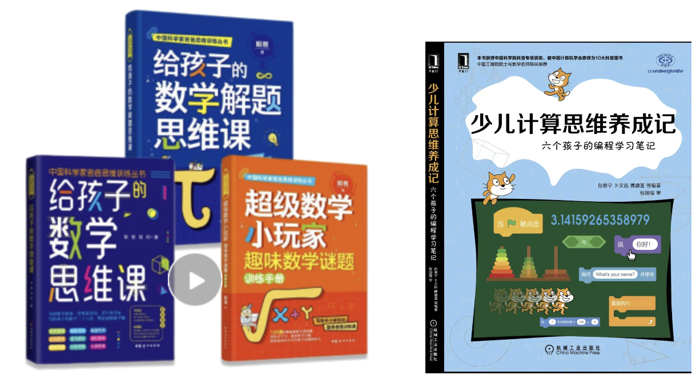

# 致谢

本书得到机械工业出版社、南京师范大学张国强教授、中科院计算所科普协会、研究生处、亲子协会等大力协助；没有这些帮助，本书的问世是难以想象的。

感谢机械工业出版社华章分社温莉芳总编、朱捷编辑青眼有加，瞩意出版；感谢赵亮宇编辑精心审阅，闫南编辑大力推广！

感谢李国杰老师、熊永昌老师精心撰写评语，鼓励有加！

感谢徐志伟老师一直以来对小SIGMA的关怀，对“计算思维能否少儿习得”的思考与探索，以及撰写热情洋溢的序言！

感谢中科院计算所科普协会王元卓、沈哲等老师热情协助，使得本书被推荐为“中国计算机协会十大科普图书”。

感谢中科院计算所研究生处为小SIGMA提供教学场地，感谢亲子协会对计算所下一代的关爱。

感谢南京师范大学张国强教授（公号：昍爸说数学与计算思维，xuanbamath），热心帮助审校、推介。师弟曾获全国数学联赛一等奖、高考数学满分；师弟致力于“青少年数学教育”，讲授数学的本源，写了[《给孩子们的数学思维课》三卷](https://item.jd.com/10035293970547.html)。数学思维和和计算思维，相得益彰！

最后，我们须得声明：整本书的脉络还得归功于老师；孩子们不是“著”，仅仅是笔记一些心得体会而已，虽然有些体会很有新意、出乎教者意料之外。

[返回上级](index.md)

