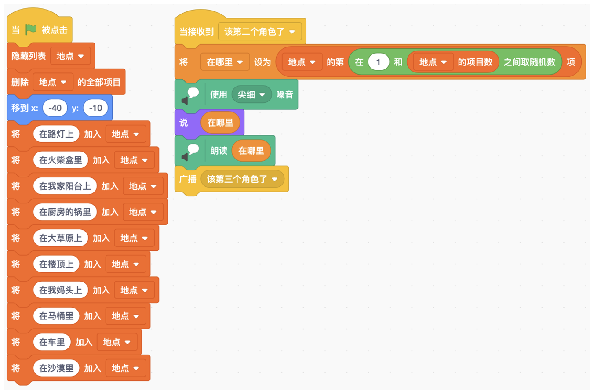
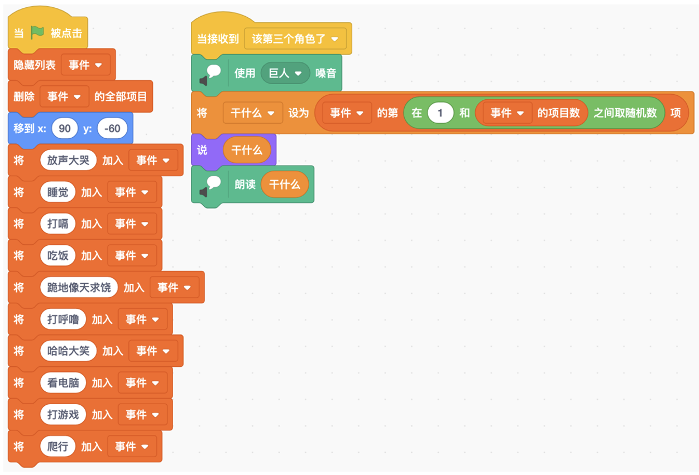
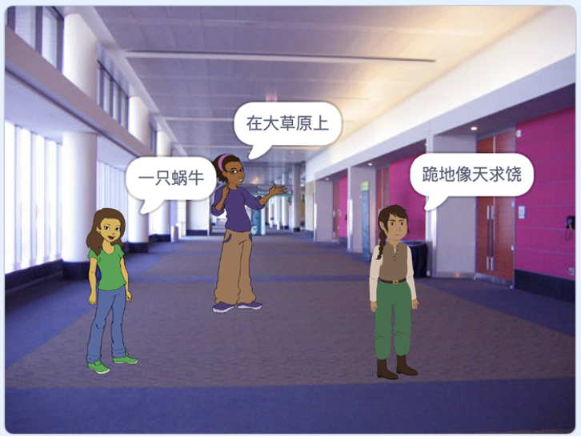

# 第10讲 收发消息:角色之间的沟通和协调

## 一、	知识点

### （1）	角色之间的沟通和协调

很多场景里面需要多个角色一起工作。比如小朋友们常玩的“谁在哪里干 什么”游戏，这个游戏中需要有三个角色，第一个角色说“谁”，第二个角色 说“在哪里”，第三个角色说“干什么”。

多个角色一起工作的时候，就需要沟通和协调，否则就会出错。还是拿这 个游戏作为例子，第二个角色要听第一个角色说完之后才能说话，第三个角色 要听第二个角色说完之后才能说话。不然七嘴八舌，游戏可就没法玩儿了。

那么在 Scratch 里，角色怎样实现“听”这个功能呢? Scratch 里面有个 “消息”机制，就是当第一个角色说完话之后，就广播一个“该第二个角色说 了”的消息;第二个角色一旦“听”到这个消息，就开始说话。第三个角色也
是进行类似的处理。

### （2）	什么是“消息”?

角色之间相互沟通时，需要传递一些话，传递的这些话就是消息。

### （3）	怎样创建消息?

打开 Scratch 软件，点击最左侧的“事件”，然后找到“广播消息 1”和“广播消息 1 并等待”这两个积木，它们就是用来给所有角色发送消息的。 

如果我们直接使用这两个积木的话，发送的消息是“消息 1”。不过用这个
“消息 1”表达不清楚我们想要说的话，很多时候我们想把消息说得更明确一点儿。 这时，我们点击“消息 1”旁边那个下三角形按钮，就会看到图 10-1 所示的界面。

图 10-1 创建新消息的过程

我们再点击“新消息”，就能创建一个含义更清楚的消息了。比如我给第
一个角色创建了消息“该第二个角色说话了”。

......

其他详细内容请参见书的第10讲。

## 二、动手练

### 实验： “谁在哪里干什么”游戏

#### 实验目的：

实现“谁在那里干什么”游戏，即：第一个人随便想一个主语，比如 “一个金枪鱼罐头”；第二个人随便想一个地点，比如“在总统府里”；第三个人想一个动作，比如“饿得发昏”。三个人依次说出来，就组成了完整的一句话“一个金枪鱼罐头在总统府里饿得发昏”。

#### 基本思路：

第一个人先想好十几个主语，放到一个列表里；想说的时候，从里面随机挑选一个出来。第二个人和第三个人类似。

第一个人说完之后发消息，第二个人收到消息之后才说话；第二个人说完之后发消息，第三个人收到消息之后才说话。

我们设置3个角色，分别是Abby、Avery和Elf。Abby负责说“谁”；Avery负责说“在哪里”；Elf负责说“干什么”。

我们玩儿了好几轮游戏，有一次这个程序说出了“一只蜗牛在大草原上跪地向天求饶”（图10-5），哈哈哈，笑死我了！

图10-2 第一个角色Abby说“谁”的脚本

图10-3 第二个角色Avery说“在哪里”的脚本

图10-4 第三个角色Elf说“干什么”的脚本

图10-5 “谁在哪里干什么”程序的运行结果示例

#### 代码下载及Web版

点击[谁在哪里干什么的代码](Code/第10讲-谁在哪里干什么游戏.sb3)下载于本地运行，或点击[谁在哪里干什么游戏Web版](https://scratch.mit.edu/projects/683249718/)直接运行

国内用户如果无法访问scratch.mit.edu的话，请点击[国内可访问的Web版](https://mblock.makeblock.com/project/1434696)直接运行

## 三、教师点评

消息是计算机中非常重要的协调和同步机制。

孩子们平时就很喜欢玩“谁在哪里干什么”这个游戏，现在通过编程实现这个游戏，理解了如何利用消息在角色间进行协调；将来把角色替换成进程、把消息替换成更复杂的结构、把广播换成定向发送，就比较容易理解了。
 

[返回上级](index.md)

