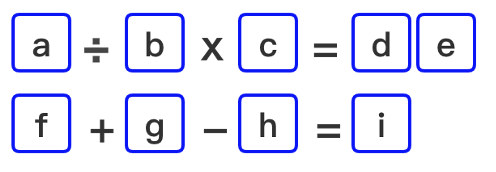
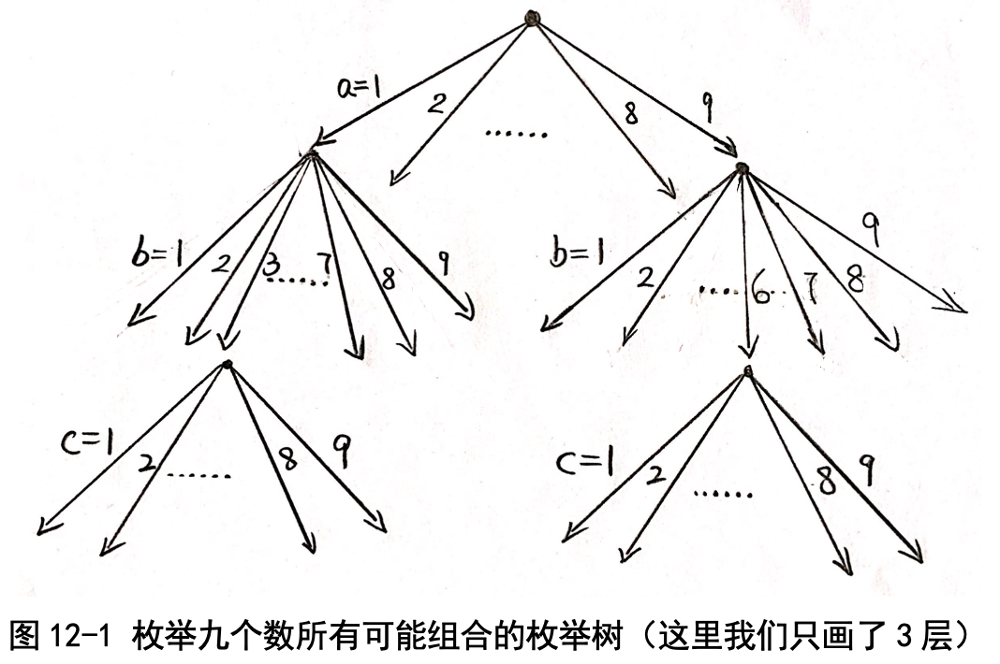
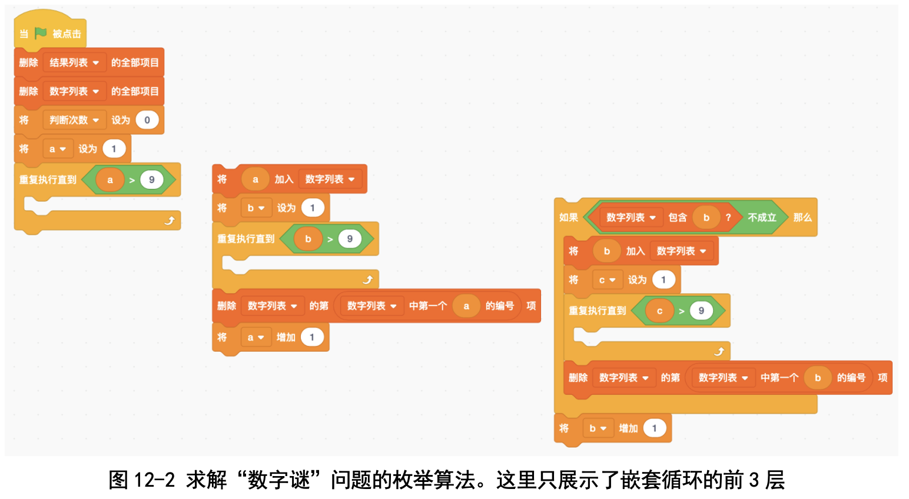
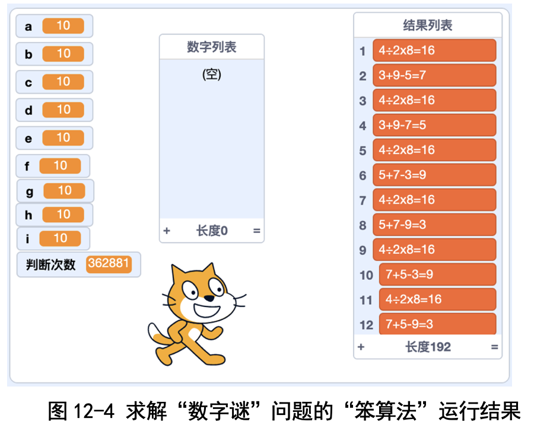
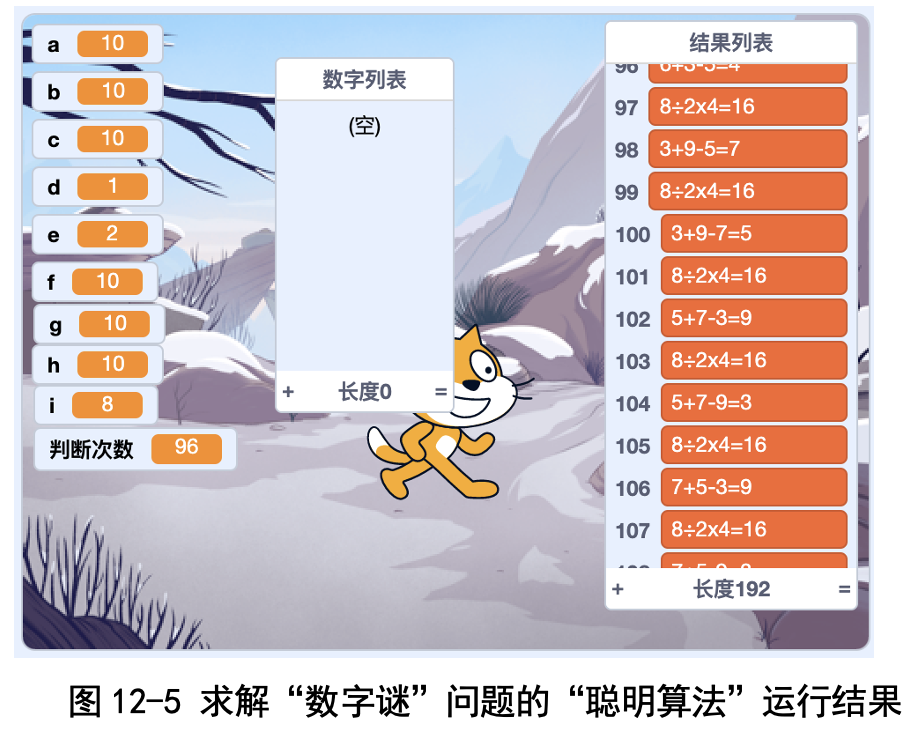

# 第12讲 聪明的枚举:巧解数字谜

## 一、实验目的

我们常常遇到这样的“数字填空题”:选择 1~9 中的数字填入空格，每个 格子填一个数字，使得等式成立。下面是一个例子。

注意:这里我们不允许数字重复使用，也就是 1~9 这 9 个数，每个数都 只能用一次。今天咱们编个程序求解这道题吧。

## 二、背景知识

### (一)最笨的方法怎么填?

老师一再告诉我们:碰到问题，先从最简单的，或者说最笨的方法开始， 再观察规律，根据观察到的规律逐步改进。

对于数字谜问题来说，最笨的方法就是“挨个试”:先试着把 a 填成 1， 把 b 填成 2，c 填成 3，d 填成 4，e 填成 5，f 填成 6，g 填成 7，h 填成 8，i 填 成 9。如果成立，那我们就胜利了;如果不成立，我们接着尝试其他填法。

这种方法叫作“枚举法”。顾名思义，就是把所有可能的填法都列举出来尝试一下，检验是否能够使等式成立。

### (二)如何使得枚举时不遗漏可能的填数方案?

使用枚举法时最容易犯的错误就是遗漏一些可能的填数方案。要想不遗漏 的话，最好的方式是“画图”:先画一个点表示 a，然后从这个点开始分支，a 能填几个数，就分几支。以咱们这个问题为例，a 能填 1, 2, 3, ..., 9，所以就 分 9 支。

接下来，针对 a 的每一种取值(就是每一个分支)继续尝试填 b，因为 b 能从1, 2, 3,..., 9中选，也有9种选择，我们就接着分9支。对c, d, ..., i这些 数以此类推。这样我们就能把所有可能的填空方案都画出来了，还不会遗漏， 很好吧?

我手工画了一下这个图:每多考虑一个变量就长高一层，每一层又分 9 支。 这个图称为“树”，真的很形象，就是一棵倒着长的树啊!

这个搜索树对 a, b, ..., i 这 9 个变量进行分支，我只画了三层，看起来就 已经很多了。怎么办呢?一个聪明的方法是“剪掉一些不可能的分支”，这样 的话树就会大大“瘦身”，计算就很快啦!

### (三)如何手工计算判断次数?

每个变量所有可能取值个数的乘积就是判断次数。这是因为每个变量的取 值变化一次，就会变成一个新的算式，判断次数就会加 1。举个例子，如果我 们用最笨的算法，每个变量都有 9 种可能，那么判断次数就是 9×9×...×9， 连乘 9 次，也就是进行 387420489 次判断。

## 三、基本思路

### (一)最笨的枚举法

让 a, b, ..., i 每个变量的取值都从 1 循环到 9，一共有 9 个变量，所以 要写一个 9 重的循环。当所有变量都确定取值之后，我们检验一下等式是否 成立。

### (二)聪明一点的枚举法

我们自己发现了一个规律，可以用来减少判断次数。第 1 个变量 a 有 9 个 选择，第 2 个变量 b 不能和 a 重复，因此只有 8 个选择，类似地，第 3 个变量 c 有 7 个选择......第 9 个变量 i 只有 1 个选择。

画图看得更清楚:搜索树的第 1 层有 9 个枝杈，第 2 层有 8 个枝杈，第 3 层有 7 个枝杈......，最后一层只有 1 个选择，就可以直接判断了，所以总共有 9×8×7×6×5×4×3×2×1 条路径，也就是进行 362880 次判断，这可比刚 才的笨方法简便多了!

### (三)更聪明的枚举法

我们自己又发现一个规律:当知道 a, b, c 的取值之后，可以算出 d, e 来，因此不用枚举 d, e 的取值。类似地，当知道 f, g, h 的取值之后，可以计算出 i 来，因此也不用枚举 i 的取值。

这样，我们只用枚举 a, b, c, f, g, h 这 6 个变量就可以了。也就是说，最多 只需要进行 9×8×7×6×5×4=60480 次判断就可以了。
事实上还有一些规律，用了这些规律之后，最聪明的算法只需要进行 96 次判断就能得出结果了。

小朋友们，你也试试吧?

提示一下，第一个式子算出 的结果必须是一个两位数，第二个式子算出的结果必须是一个一位数。利用这 两个性质进行排除，判断次数还会大大减少。

### 代码下载及Web版

点击[求解数字谜的代码（聪明很多的算法）](Code/第12讲-数字谜-聪明很多的算法.sb3)下载于本地运行，或点击[求解数字谜Web版](https://scratch.mit.edu/projects/683253861/)直接运行

国内用户如果无法访问scratch.mit.edu的话，请点击[国内可访问的Web版](https://mblock.makeblock.com/project/1434703)直接运行

点击[求解数字谜二的代码（聪明的算法）](Code/第12讲-聪明的枚举-数字谜二-聪明的算法.sb3)下载于本地运行，或点击[数字谜二的Web版](https://scratch.mit.edu/projects/683254787/)直接运行

国内用户如果无法访问scratch.mit.edu的话，请点击[国内可访问的Web版](https://mblock.makeblock.com/project/1434707)直接运行

## 六、实验结果

### (一)算法找到多少种答案?

如图 12-4 所示，不管是用笨办法还是聪明的办法，最终找到的答案都是 一样的— 96 种答案(因为两个算式组成一种答案，所以共有 192 个算式)。

### (二)对比笨算法和聪明算法的判断次数

超级笨办法的判断次数是 387420489(天啊，要算这么多次)，聪明一点的算法的判断次数是 362881 次(见图 12-4)，而最聪明的算法只需要判断 96 次 (见图 12-5)!“刷”的一下就运行结束!不同算法的差别真大呀!

## 七、思考与延伸
在上课时，我们想起来那个“算 24”的游戏，就是给定 4 个数，用加减 乘除运算(允许带括号)算出 24 来。我们把这个程序改动一下，加上数字的 换位就可以了。

写完这个程序之后，我们又写了一个程序，解一个新的数字谜:将数字 0, 1, 3, 4, 5, 6 填入空格，每个数字只能使用 1 次，使得下面这个等式成立。小朋 友们，你们也试试吧!

## 八、教师点评

“数字谜”是常见的小游戏，可以采用“枚举”策略来解决。同学们通过 嵌套的循环，领会了基于枚举策略的求解方法。

枚举的关键是“剪枝”，就是尽量减少不必要的分支。比如在这个题目里， d, e 和 i 这 3 个变量可以直接确定，不需要枚举。对比带剪枝的和不带剪枝的 算法，孩子们对剪枝的威力印象深刻!

对这个题目，我们是从先实现最笨的方法开始，观察到规律就改进一下， 再观察到规律再改进一下。孩子们也领会到了“不能一口吃个胖子”，要“逐 步优化”。

枚举过程中一定要注意剪枝，那怎样进行剪枝呢?

兰老师讲过一个很有效的策略，叫“找突破口”，就是说通过分析和推理， 能够排除一些变量的取值。

拿“思考与延伸”里的那个数字谜为例，有 a, b, c, d, e, f 六个变量，为什么分支的时候一定要从 a 开始呢?先考虑哪一个变量结 果都是一样的，要是先考虑取值范围少的变量，枚举会更简单。

我们可以这样分析:

### 第一步:找一个突破口。
我们来看 a×b=c2 这个等式。两个数乘积的个位数怎样才能变成“2”呢?枚举一下发现这两个数的组合只能是 1×2，2×1，3×4，4×3，2×6， 6×2 这几种。不过因为 2 不能用，所以只能是 3×4 或 4×3。3×4=4×3=12 说明 c 只能等于 1。a 等于 3，b 等于 4 或者 a 等于 4，b 等于 3。
用 a×b=c2 这个等式，一下子能够排除很多组合，所以这个等式是一个很 好的“突破口”。

### 第二步:根据 de÷f=12 这个等式，我们可以推断出 e 只能是 0。 

原因很简单:f 是除数，所以不能是 0;d 出现在十位上，也不能是 0。 如果 d 是 5，那么 f 就是 6，但是 50÷6=12 不成立，因此只剩下一种可能
性了:d 是 6，f 是 5，60÷5=12，等式成立。 第三步:连接上面两个等式，得到下面两种填法:

第一种:3×4=60÷5=12

第二种:4×3=60÷5=12 

这种“找突破口”策略很灵:我们只需要考虑 2×1×1×1×1×1×1=2 种
组合，比笨的枚举法快多了! 

我们结合奥数课的内容设计了这次练习。孩子们发现笨方法考虑的填法太
多了，单靠手工计算是很难完成的，只有写程序才能完成，而聪明的方法只看 几步就行了。“枚举一定要注意剪枝，剪枝的关键是找准突破口，先考虑那些 选择范围少的变量”，这是我们想让孩子们领会的计算思维之一。

[返回上级](index.md)
