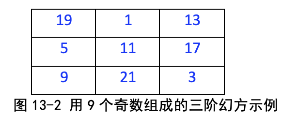
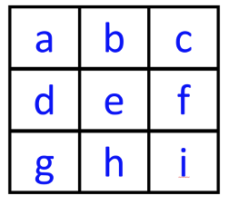
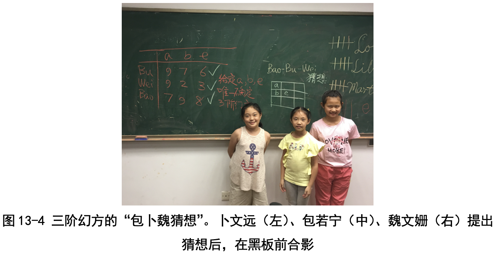
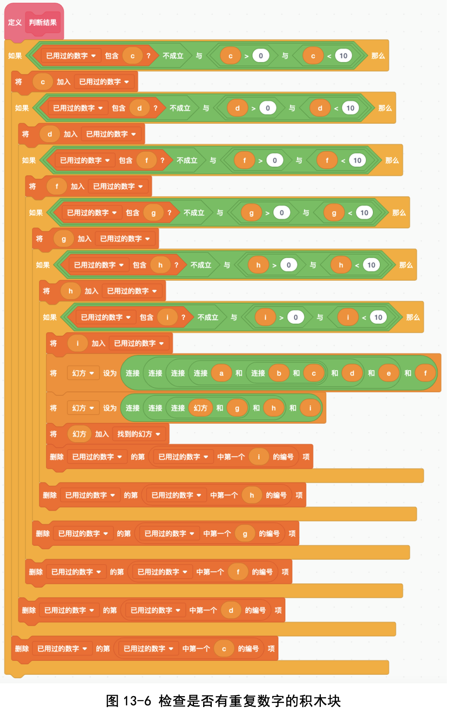

# 第13讲 再论聪明的枚举:三阶幻方

## 一、实验目的
三阶幻方是一个有趣的游戏。这个游戏是这么玩的:有一个 3 行 3 列的九 宫格，让我们把数字 1~9 填入格子之内，每个格子只 能填一个数，要求是每行、每列、每条对角线的加和都
相等。比如图 13-1 中就是一种填法。

  我们验算一下:
  
  行和 6+1+8=7+5+3=2+9+4=15，
  
  列和 6+7+2=1+5+9=8+3+ 4=15，
  
  两条对角线 6+5+4=8+5+2=15，
  
  的确都相等。

包老师问我们:“除了这种填法之外，还有多少种填法?能不能写个程序 把所有的填法都找出来呢?”

## 二、背景知识

### (一)什么是幻方?
三阶幻方是最简单的幻方，是由 9 个数组成的一个 3 行 3 列的矩阵，其每 一行、每一列和两条对角线的数字之和(称为幻和值)都相等。
 
 一般常常用 1, 2, 3, ..., 9 这 9 个数填三阶幻方， 不过也可以换用其他数，比如，用 1, 3, 5, 9, 11, 13, 17, 19, 21 这 9 个奇数组成图 13-2 所示的三阶幻方。 你看这里的幻和值等于 33，和上一个幻方完全不一 样了。
 

### (四)三阶幻方的“包卜魏猜想”

我们三个(包若宁、卜文远和魏文珊)发现了一个规律:只要知道 3 个数， 即中心数 e，左中数字 d，左上角数字 a，就能唯一确定三阶幻方!

我们的步骤是这样的:

(1)第一步:既然知道了 e，那么幻和值就能求出来了，肯定是 3e。 

(2)第二步:知道了 a, d，用幻和值减去 a 和 d，就能得到 g。 

(3)第三步:知道了 a, e，用幻和值减去 a 和 e，就能得到 i。

这样一步一步推导，就能把整个幻方全部推出来了!这种方法不仅适用于 由 1~9 组成的幻方，由其他数构成的幻方也适用!图 13-4 是我们当时在黑板 上推理时画的幻方。

发现了这个规律，我们太兴奋了!老师也非常高兴，把我们这种方法命名 为“包卜魏猜想”。我们也有以自己名字命名的猜想啦!

## 三、基本思路

### (一)最笨的填法是怎么的?
我们可以枚举所有可能的填法，然后检验每种填法，判断是否构成幻方。 比如:如果将 a 设为 1，那么 b 就要从 2~9里选择一个数，有 8 种可能;如 果将 b 设为 2，那么 c 就要从 3~9 中选择一个数，有 7 种可能;因此，将 9 个数填入 3×3 的表格，一共有 9×8×7×6×5×4×3×2×1=360880 种可能 的排列，每种情况需要进行 8 次判断(检查 3 行之和、3 列之和、3 条对角线 之和)，来判断是否构成三阶幻方。

### (二)聪明的方法怎么填?
刚才那种枚举的组合太多了!老师在给我们讲“数字谜”问题的时候就一 再强调，枚举时一定要看能不能剪枝。换句话说，在填入数字的时候，就要考 虑三阶幻方的数值约束，不要等到最后再判断。这样做的好处是能够尽快排除
很多组合，比如:

● 我们尝试 a=9, b=8，这时 a+b 已经比 15 大，其他的 c, d, e, ..., i 就不用
试了。

● 因为 a, b, c 之和为 15，只需要给定 a, b 的数值，即可推导出符合约束
的 c 的数值。比如 a = 9, b=1，可以推导出 c=6，不用再枚举 c 了。

### 代码下载及Web版

点击[求解三阶幻方的代码](Code/第13讲-三阶幻方.sb3)下载于本地运行，或者点击[三阶幻方Web版](https://scratch.mit.edu/projects/683255301/)直接运行

国内用户如果无法访问scratch.mit.edu的话，请点击[国内可访问的Web版](https://mblock.makeblock.com/project/1434708)直接运行

## 五、实验结果

我们的程序运行得非常快，找到了 8 种幻方填法。

那这些结果对不对呢?我们手工枚举了一遍(用“包卜魏猜想”枚举很 快)，和程序运行结果完全一致。我们也实现了笨方法和聪明的方法，这两种 方法的结果是一样的，只是聪明的方法判断次数少得多(见图 13-7)。

## 六、思考与延伸

三阶幻方我们会做了，那五阶幻方怎么做呢?道理是类似的，我们扩展一 下“包卜魏猜想”，五阶幻方可以很快地枚举出来。

## 七、教师点评

这堂课的重点和“数字谜”问题一样，还是“枚举时一定要注意剪枝”。

孩子们自己发现了“包卜魏猜想”，非常兴奋!学数学以及做数学研究时 (甚至不限于数学)形式猜想是一个很重要的步骤。写的这个程序也是完全依
赖于“包卜魏猜想”进行剪枝，因此写程序时热情高涨，这很好!

[返回上级](index.md)
