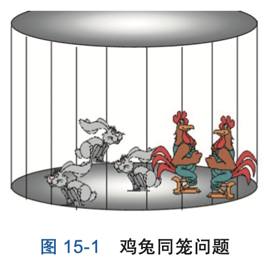
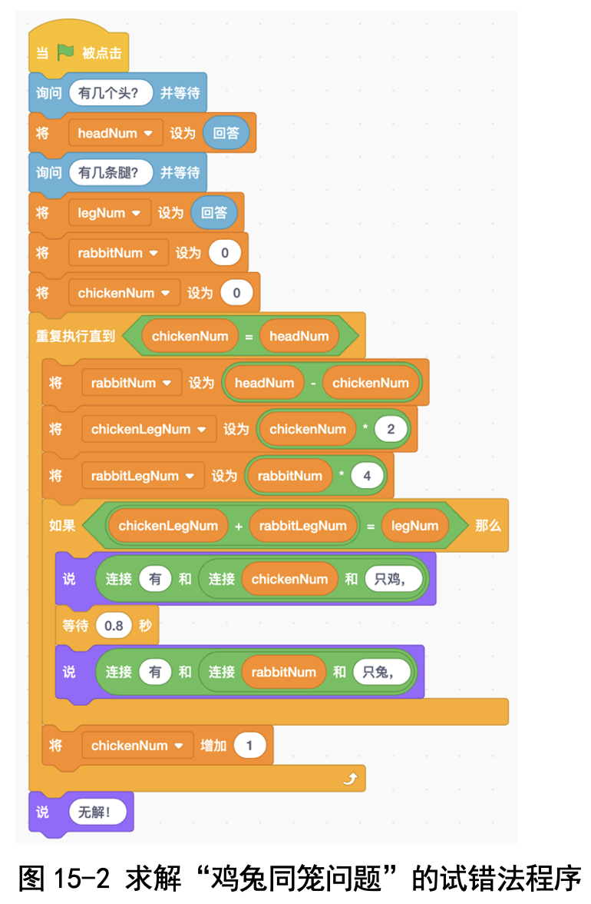
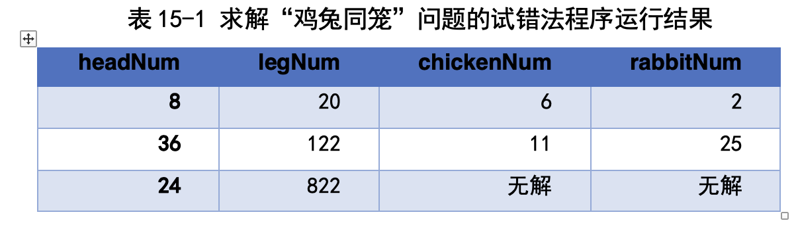
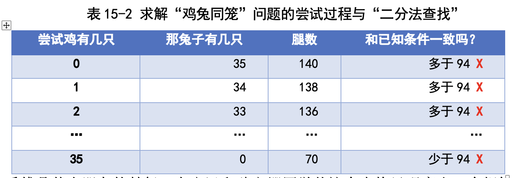

# 第 15 讲 用“试错法”求解鸡兔同笼问题

## 一、实验目的

今天我们编程求解鸡兔同笼问题，就是请用户输入鸡和兔子的总头数和总 腿数，程序要输出鸡的数目和兔子的数目。

## 二、背景知识

### (一)什么是鸡兔同笼问题?

鸡兔同笼是我国古代著名趣题之一。大约在公元四、五世纪，《孙子算经》 中就记载了这个有趣的问题，书中是这样叙述的:“今有雉、兔同笼，上有 三十五头，下有九十四足，问雉、兔各几何?”这里的“雉”就是鸡的意思。

这段话的意思就是鸡与兔子混在同一笼内，已知鸡兔共有的只数与腿数， 求有几只兔子几只鸡(见图 15-1)。

### (二)怎样求解鸡兔同笼问题?

#### (1)试错法 

试错法是一种重要的思考问题的方法，包括“尝试，验证对错，如果错误
则修正后继续尝试”三步。

详细地说，我们先假设待求的数取某一个值，然后 通过推导、验证已知条件，看这个假设对不对;如果不对，则想办法修正这个 假设。这样不断修正，最后求出问题的解来。

用试错法解答鸡兔同笼问题就可以先假设笼子里全是鸡，于是根据鸡兔的 总数就可以算出共有几条腿，把这样得到的腿数与题中给出的总腿数相比较， 如果一致则求解完毕，否则看看差多少条腿，每差 2 条腿就说明有 1 只兔子， 因此将所差的腿数除以 2，就可以算出共有多少只兔子。

以《孙子算经》记载的问题为例，用假设法求解的过程如下:

假设笼子里全是鸡，即鸡有 35 只，兔子有 0 只，则一共有 35×2=70 条 腿，但是已知总腿数是 94，这比总腿数少 24 条。

看来全都是鸡这个假设不 对，那该怎样修正假设呢?我们尝试修正一下:

● 要是少 1 只鸡的话，即有 34 只鸡和 1 只兔子的话，共有 34×2+1×4=72 条腿;

● 要是少 2 只鸡的话，即有 33 只鸡和 2 只兔子的话，共有 33×2+2×4=74 条腿。

这时候几位同学都看出规律来了:每少 1 只鸡，就多 1 只兔子，会多出 2 条腿。刚刚我们已经看到，当假设全部都是鸡的时候，少了 24 条腿;因此， 应该有 24÷2=12 只兔子，有 35-12=23 只鸡。

#### (2)列方程法 

列方程解题有个小窍门:凡是不知道的数(叫未知数)，先用一个符号表
示，比如 x, y, z 等，然后把已知条件用这些未知数表示成等式。先把方程列出 来，再看怎样解这些方程，求出未知数。

在“鸡兔同笼”的问题中，可以设有 x 只兔子，然后根据鸡、兔的只数与 腿数的关系列出方程来。以上面的问题为例，用列方程法求解:

设有 x 只兔子，则鸡有 35-x 只，总腿数是 4×x+2×(35-x)。现在我们又 已知总腿数是 94，因此可以列出等式:

4×x+2×(35-x)=94 

化简一下，可以得到:
    2×x+2×35=94

最终可以得出 x=12，即兔子有 12 只，鸡有 23 只。

## 三、基本思路

 我们采用“试错法”来编程求解鸡兔同笼问题:我们尝试猜测鸡的数目。 详细地说，先尝试鸡的数目是 0，逐渐增加到总头数;对每一次尝试，都算出 兔子的数目，再算出总腿数，并和已知的总腿数比较，看两者是否一致，如果 一致，则找到了答案，否则就增加鸡的数目。
 
这里的“尝试 - 验证 - 再尝试”循环就用“重复执行直到”积木块实现吧!

### 代码下载

[求解鸡兔同笼问题的代码](Code/第15讲-鸡兔同笼.sb3) 

## 六、实验结果

输入几组不同的 headNum 和 legNum，程序的输出如表 15-1 所示。前两 组都是对的;最后一组有 24 个头，但是却有 822 条腿，这显然不可能，程序 报告“无解”。

## 七、思考与延伸

(1)鸡兔同笼问题中腿的总数量能否为奇数?

(2)用鸡兔同笼问题的解法可解决类似的问题:停车场上共停放 56 辆小 轿车和自行车，两种车轮子数总和为 38 个，小轿车和自行车各有几辆?

(3)把上面的问题中的自行车换成三轮车呢?

## 八、教师点评

鸡兔同笼是经典问题。我在给孩子们上数学课时讲过这个问题，当时引导 孩子们用“试错法”思考。试错法是一种“正向”的思维方式，首先能够促进
孩子们理解题意，更重要的是能够促进孩子们去大胆尝试。 与之相反，求解问题是一个“逆向”思考过程，只有在进行充分的正向思
考、弄懂问题的意思之后，才能更好地理解逆向解法，甚至自己发现逆向解 法。从教学的角度来说，直接教“逆向”求解法也不是不可以，但是往往会有 一些害处:孩子们只是单纯地背会了解法，对于这种解法是怎样得出来的，自 己能否想出来却没有头绪。

在引导孩子们采用“正向”思维方式进行尝试时，还发生了一件令我吃惊 的事情:傅鼎荃同学自发地想出了“折半查找法”。当时我们求解《孙子算经》 里的例子，我在黑板上画出了这样的表格，表示尝试过程(见表 15-2)。

当我带着孩子们尝试到鸡有 2 只时，孩子们说:“这样算下去，太累了! 腿数总是远远多于 94 !老师，咱们干脆尝试鸡有 35 只试试看。”

于是我们就直接尝试鸡有 35 只是否正确;我在表格中间空了一行，表示 跳过了一些尝试。

结果很不幸，这次也不对，腿数又太少了!现在该尝试鸡有多少只，是 从大到小尝试鸡有 34 只，还是继续刚才的从小到大的过程，尝试一下鸡有 3 只呢?

这时傅鼎荃同学站起来说:“老师，咱们不尝试有 34 只鸡，也不尝试有 3 只鸡，而是从中间尝试，试试鸡有 17 只行不行”。这是计算机里经典的“折半 查找法”啊!我们从来没有教过孩子们这个方法，这完全是傅鼎荃自发地想出 了这个方法!这是我们“慢数学”教学的一个小小的胜利!

受傅鼎荃小朋友的鼓舞，卜文远和魏文姗同学从这个表格里观察出一个规 律:每多 1 只鸡，就少 2 条腿。这样不用枚举也行啊!至此，可以说孩子们已 经完全掌握了这个问题的求解方法。甚至后来碰到“铁块重 3 千克，铜块重 5 千克，已知共 6 块金属，总重量 20 千克”的问题时，也立刻反应出这就是鸡 兔同笼问题。

至于列方程求解法，孩子们反而觉得太麻烦:列方程简单，解方程好难。 我们干脆只要求孩子们会列方程即可，至于解方程，让孩子们用“方程求解” 软件 https://zh.numberempire.com/equationsolver.php 就行了，孩子们很高兴!

[返回上级](index.md)
