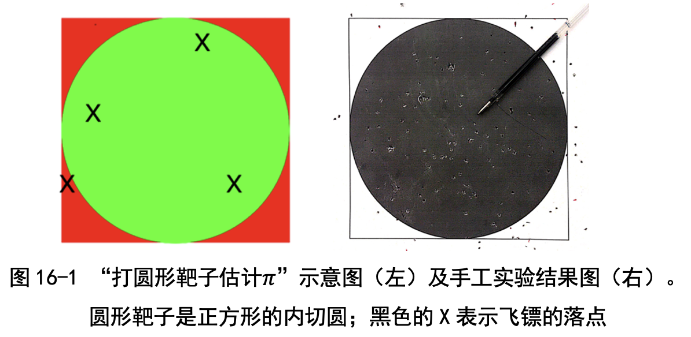
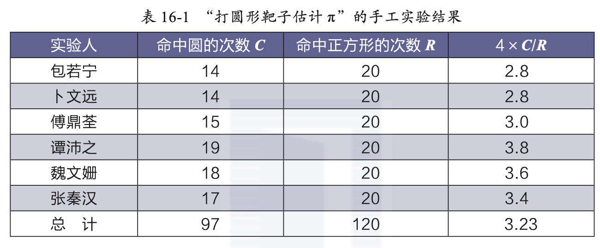
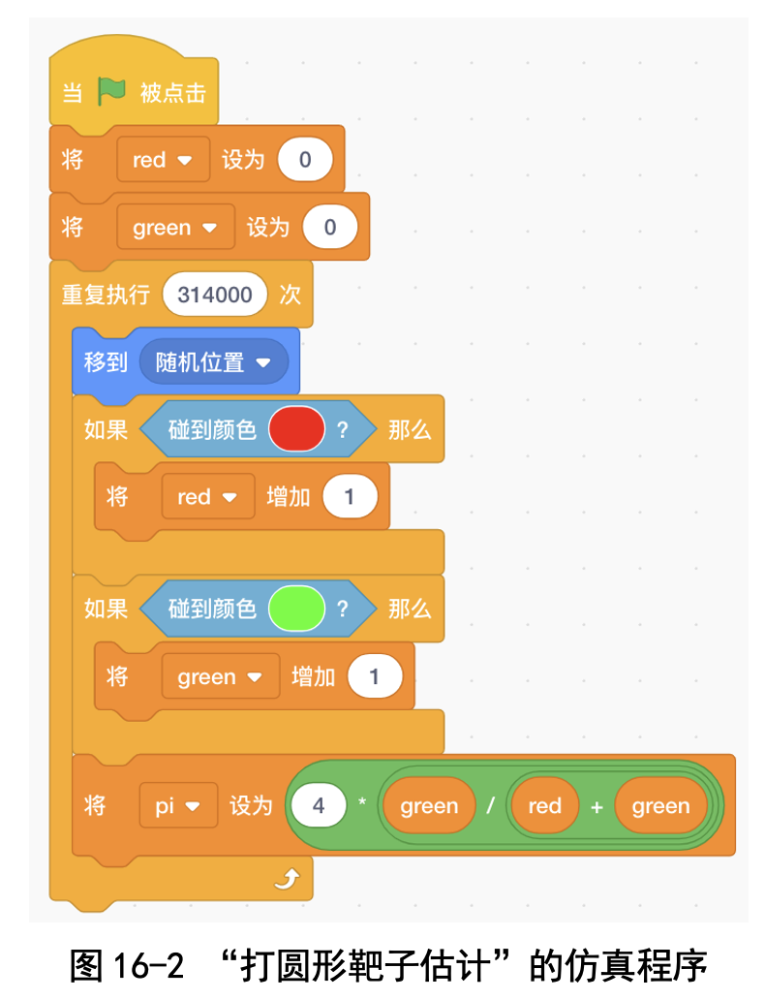
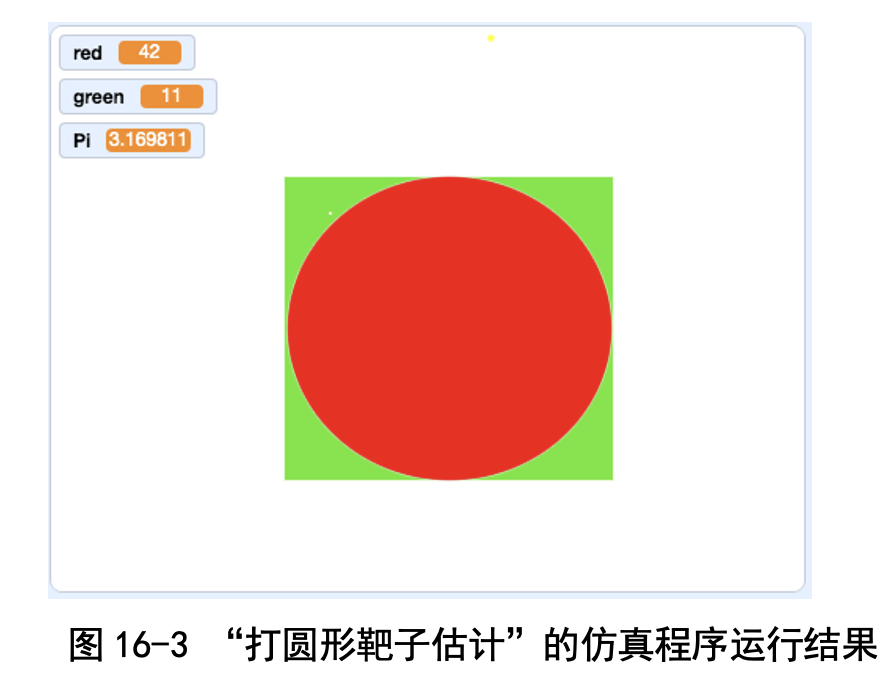
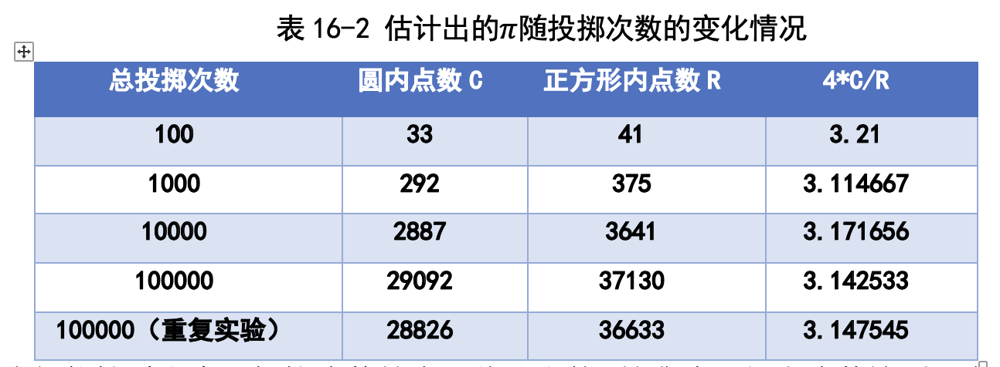
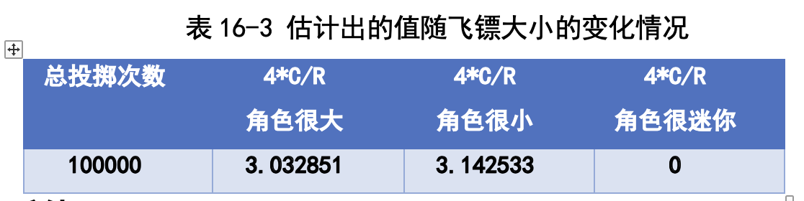
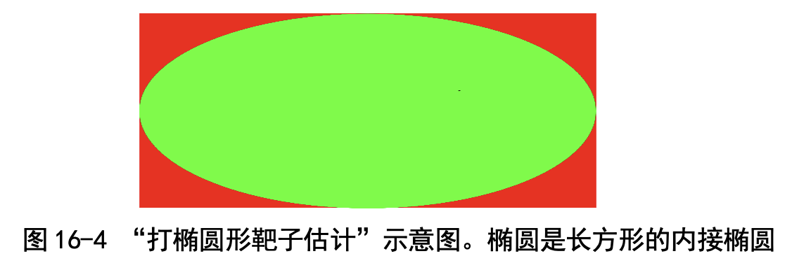

# 第 16 讲 随机有威力:打圆形靶子估计 π

## 一、实验目的
在 2020 年 3 月 14 日数学节那一天，我们编程实现了刘徽割圆法，估计出 的圆周率 π=3.141592653，精确到了小数点后 9 位，非常准!

刘徽割圆法是估计圆的面积:对于半径为 1 的圆，面积就是 π。我们写的 程序是估计圆的周长:对于半径为 1 的圆，周长就是 2π。
除了直接估计圆的面积或者周长，还有没有办法来估计 π 呢?

有的，通过打圆形靶子也能估计!这种方法是这样的:大家都玩过扔飞镖 吧?如图 16-1 左图所示，我们做一个正方形靶子，然后紧贴着正方形内部画 一个圆(老师说这叫“内切圆”)。我们随意投掷飞镖，尽量让飞镖落在正方形 上任何位置上的可能性都差不多，可不是瞄准靶心扔飞镖啊!

老师说理论上，扔 4 次飞镖的话，大概会有 3 次落在圆里;扔 40 次飞镖，大概会有 31 次落在圆里;扔 400 次飞镖，大概会有 314 次落在圆里。看，π 的影子出来了!这个理论到底对不对呢?我们自己扔飞镖试试看，然后再编程 模拟检验一下吧!

## 二、背景知识

我们做过的刘徽割圆法是估计圆的面积或者周长，跟 π 的关系是显而易见 的，但是打靶子射中圆形的次数为什么跟 π 有关系呢?

卜老师讲了一个例子，我们一听就明白了:假如正方形的边长是 2m，那 么面积就是 2×2=4m2;内切圆的直径是 2m，那么面积就是 π。

假设我们往这个面积为 4m2 的正方形里倒 400 粒黄豆，摇晃摇晃，让黄豆 均匀散开，那么大概会有 314 粒黄豆在圆里。

这非常好理解:因为圆和正方形的面积之比就是 π∶4，所以当黄豆均匀散 开时，落在圆内的黄豆数目和落在正方形内的黄豆数目之比也应该是 π∶4。这 个例子很说明问题:不去算圆的周长或者面积，数黄豆也能估计出 π。打靶子 命中圆的次数跟这里落在圆内的黄豆数目是一回事。

当然了，得到这个结果的前提是黄豆均匀散开，要是没摇晃均匀，都集中 在中间，那就不对了。卜老师说这个方法叫作蒙特卡罗方法，是很有用的算 法，我们一定要掌握啊。

## 三、基本思路

为了找感觉，我们先做了一个“扔飞镖”实验:在一张纸上画圆(半径是 10cm)以及外接正方形(边长是 20cm)，然后向纸上投掷圆珠笔芯，记录命中 正方形的次数 R，记录命中圆的次数 C。看图 16-1 吧，这就是那千疮百孔的 靶子!

我们会发现:当投掷的次数足够多，能覆盖整个区域的时候， C/R 会接近于“圆的面积 ÷ 正方形的面积”。接下来我们就算一算这两个面积之比到底 是多少。因为圆的面积 C=π×100，而正方形的面积 R=400，所以面积之比 C/R =  π×100 / 400 =  π /4。这样我们就得到了 π 的估计值: π = 4×C/R。

我们 6 位同学，每人手工投掷了 20 次，得到如表 16-1 所示的结果。

如果单独看我们每个人的投掷结果的话，估计得出的值虽然在 π 附近，但 误差都比较大。把我们所有人的投掷结果放在一起再估计，就得到了估计值 3.23，这就比较接近 3.14 了。

我们重复模拟投掷多次，每次都执行下述操作: 

(1)飞镖移动到随机位置。 

(2)判断落点的颜色。 

(3)如果是红色，将红色计数器 red 增加 1。 

(4)如果是绿色，将绿色计数器 green 增加 1。
  
  落在正方形区域的次数是 red+green，落在圆形区域的次数是 red，因 此可以用 4×red / (red+green) 估计 π。这个问题的仿真程序如图 16-2 所示。
 

### 代码下载及Web版

点击[打圆形靶子估计Pi的代码](Code/第16讲-打圆形靶子估计Pi.sb3)下载于本地运行，或点击[打圆形靶子估计Pi的Web版](https://scratch.mit.edu/projects/683356526/)直接运行

国内用户如果无法访问scratch.mit.edu的话，请点击[国内可访问的Web版](https://mblock.makeblock.com/project/1434719)直接运行

## 六、实验结果

我们的程序运行结果是图 16-3 中这样的。

我们多次运行程序，每次的投掷次数不同，得到的 π 的估计值如表 16-2所示。

我们能够看出来，投掷次数越多，估计出的 π 越准确。但当次数达到一定 规模时，准确率精度增加得很慢，与刘徽割圆法相差很多。卜老师说蒙特卡罗
方法的精度不高的原因很多，比如计算机里的随机数都是伪随机数，不能保证 非常均匀，此外，我们用颜色来表示飞镖落在哪个区域，误差比较大。

我 们 重 复 了 两 次 投 掷 100000 次 的 实 验， 发 现 得 到 的 估 计 值 一 个 是 3.142533，另一个是 3.147545，差异竟然很大!

我们还改变了飞镖的大小，结果放到表 16-3 中，我们发现大飞镖的误差 也很大(见表 16-2)。这是因为大的飞镖会很容易落到红色和绿色区域的交界 处，检测颜色就不准了。不过用非常小的飞镖也不行，会检测不到颜色，这一 点很奇怪，我也没弄明白。卜老师说这应当是 Scratch 系统的一个缺陷。

## 七、思考与延伸
在背景里画圆，有时候画得不太圆，结果成椭圆了，外接的正方形也变成 了一个长方形(见图 16-4)。那换成椭圆和长方形，结果有没有变化呢?

从表 16-4 中的实验结果来看，椭圆和长方形组合得到的估计值更接近于 π 的真实值。我们在讲“两颗钉子一根绳画椭圆”时，说过椭圆和圆是一回事。 卜老师还提过圆和椭圆的面积和周长计算方法都很像，看来真的是这样啊!

## 八、教师点评

蒙特卡罗方法是由乌拉姆和冯·诺依曼于 1946 年在美国洛斯·阿拉莫斯 实验室造氢弹时提出的。提出这种方法的动机是:造氢弹需要求解的一些问 题，比如复杂函数的积分，用传统的“确定性的数学方法”难以求解，乌拉姆 想出了“随机模拟仿真”方法，很好地解决了这个问题。

这里说的“确定性的数学方法”是什么?孩子们难以理解。我们举了一个 例子来说明:假如给了孩子们一幅中国地图，让孩子们估计中国的国土面积， 该怎么办呢?孩子们上四年级了，学过了规则图形的面积计算方法，比如矩形 面积就是长乘宽，三角形面积就是底乘高再除以 2，圆的面积是 π 乘以半径的 平方。

我们告诉孩子们，这种规则图形的面积计算方法就是“确定性的数学方 法”，可是中国地图的边界弯弯曲曲的，这种确定性的方法好是好，可是没法 用啊!

那我们就换一种思维方法:把中国地图贴到一个正方形里，向正方形里撒 黄豆，数一数正方形里的黄豆数目(或者称一下黄豆的重量)，再数一数落到 中国区域里的黄豆数目，求出两者之比，再乘以正方形面积，就能够估计出中 国的国土面积了。这种方法就是蒙特卡罗方法!

在编程之前，我们先举了“在正方形里撒黄豆”的例子，孩子们很快就能 明白，然后孩子们自己动手，用圆珠笔芯当作飞镖，在纸上投掷，得到了感性 认识。这样，最后编程就非常容易了!

这一堂课中用到了前面两堂课的知识: 

(1)孩子们将得到的结果和已经实现过的“刘徽割圆法”进行对比，看看
哪种方法估计出的 π 的精度更高。孩子们对此很感兴趣。 

(2)把圆换成椭圆，把正方形换成长方形，孩子们发现一样能够进行估
计，这验证了“两颗钉子一根绳画椭圆”那堂课中顺便提到的一个知识点:椭 圆跟圆很像，面积和周长的计算公式非常像!

用随机现象进行模拟，能够大大降低问题的求解难度，希望孩子们长大后 能够想起那张扎得千疮百孔的靶纸，想起这个程序!

[返回上级](index.md)
