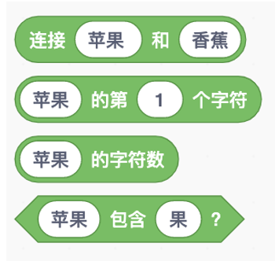
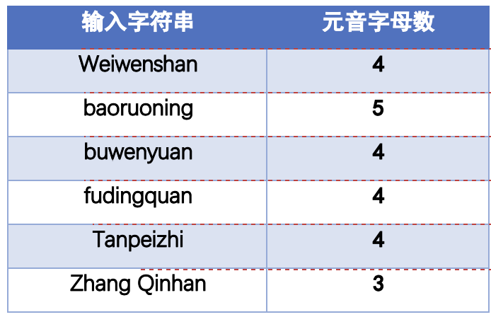

# 第11讲 逐级逼近法:刘徽割圆法估计π

## 一、实验目的

## 二、背景知识

**（1）	角色之间的沟通和协调** 

图 9-1 字符串的基本操作

## 三、基本思路

图 9-1 字符串的基本操作

**代码下载** 

[元音字母记数的代码](Code/第9讲-元音字母数目.sb3) 

## 六、实验结果

表9-1 SIGMA兴趣组同学姓名中的元音字母数

## 三、教师点评

字符串是一个基本数据类型，就是把几个字符串成一串。日常生活中，我 们的姓名就是一个字符串。通过数姓名中元音字母个数这个小实验，孩子们掌 握了字符串的基本操作。

值得说明的是，Scratch 里没有数据类型的概念，即不区分字符串、整数 和小数，因此，我们要避免出现“对字符串变量进行加减乘除”的情况。

**（1）生平** 

[返回上级](index.md)
