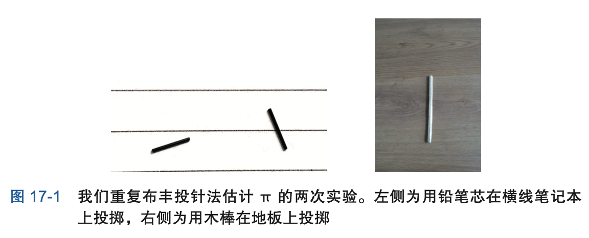
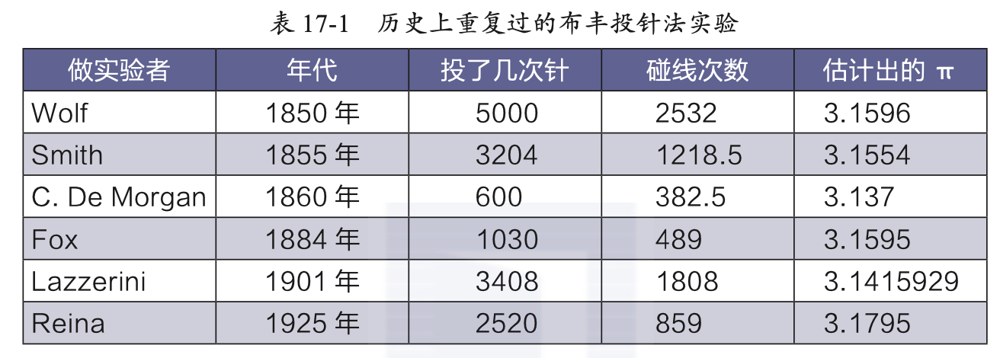
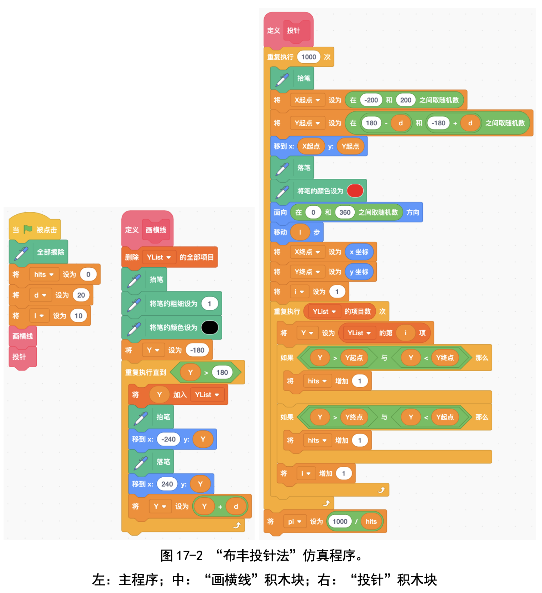
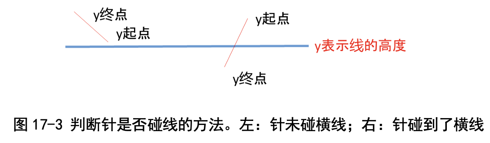
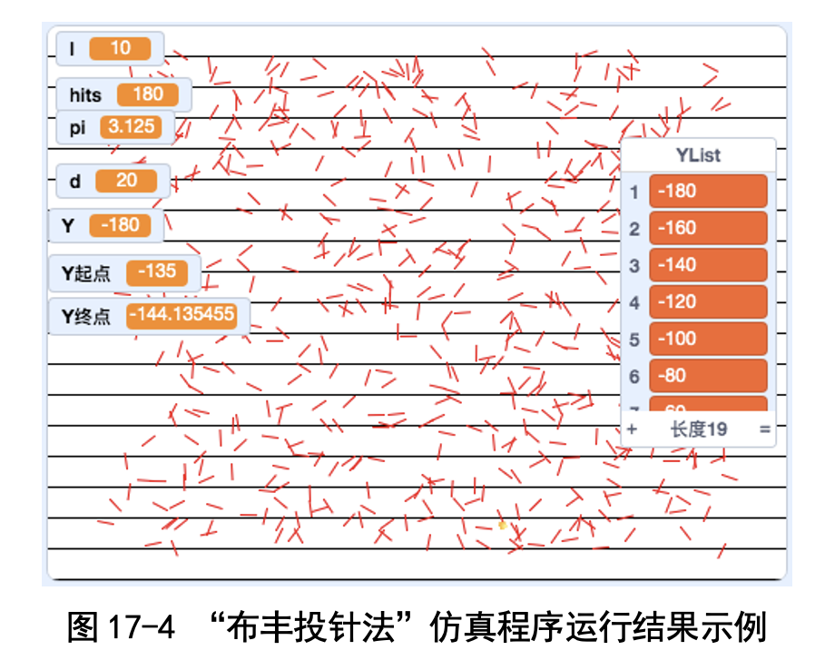
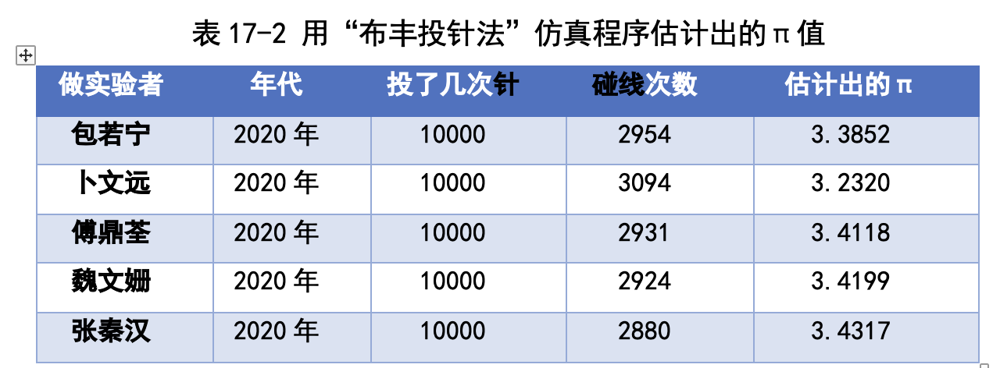
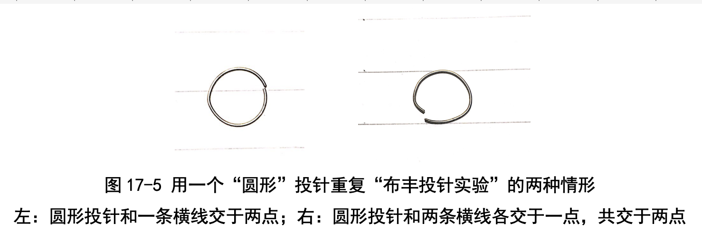
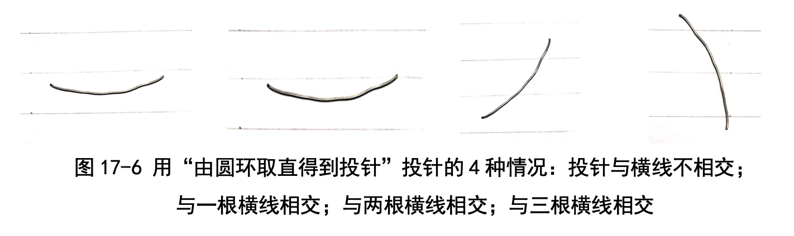
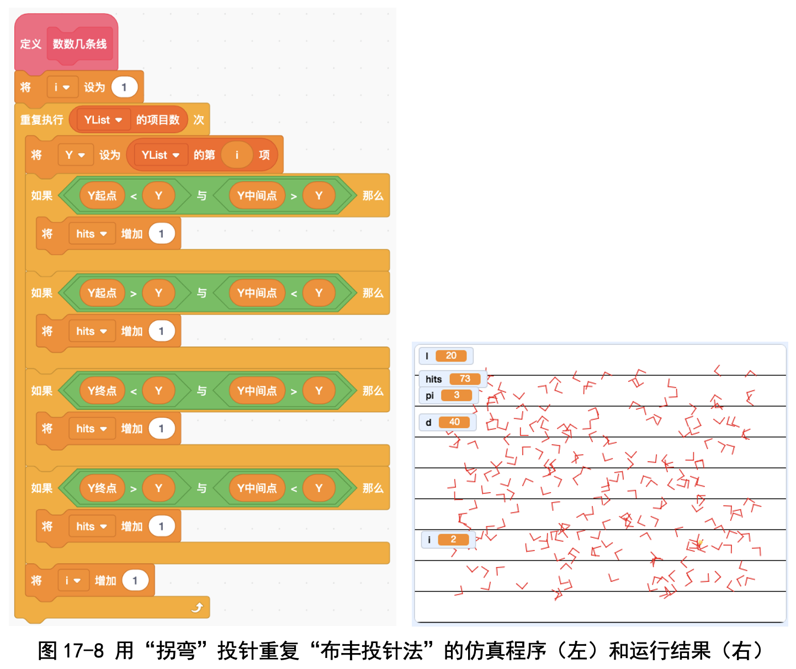

# 第 17 讲 再论随机有威力:布丰投针估计 π

## 一、实验目的

我们学过了用“刘徽割圆法”估计圆周率，是利用了半径为 1 的圆(称作 单位圆)的周长是 2π 这个性质，第 16 讲中又学过了打圆形靶子估计 π，是利 用了单位圆的面积等于 π 这个性质。

除了这两种方法，还有一种估计 π 的方法，叫作“布丰投针法”。不过这 种方法很奇怪:根本看不到圆，就是在纸上画一些横线，然后扔一根针，数一 数针碰线的次数就行了。

我们实际动手在横线笔记本上做了实验:横线之间的间隔是 1cm，我们折 了一段长为 1cm 的铅笔芯当作针，投掷到本子上。因为铅笔芯的长度恰好等 于线的间隔宽度，因此铅笔芯有时候碰不到线，有时会碰到一根线，但不会 碰到两根线。我们扔了 15 次，碰线 10 次;或者说要想碰线 2 次，平均得扔 3 次。我们又重复了一回:扔了 15 次，碰线 9 次，结果很稳定。图 17-1 左图就 是我们做实验时的照片。

在纸上投掷铅笔芯太不方便了。卜文远家里的木地板有接缝，就锯了一根 小木棍，长度等于一块木地板的宽度，然后往地板上扔小木棍(图 17-1 右图)。 卜文远一共扔了 60 次，撞线 38 次。

卜老师提醒我们算一算“要想碰线 2 次的话，平均得扔几次小木棍”。我们 是这样算的:扔了 60 次碰线 38 次，那么碰线 1 次平均需要扔 60÷38=1.57 次 小木棍，碰线 2 次平均需要扔 2×1.57=3.14 次小木棍。咦，又看到 π 的影子了!真 奇怪，根本没有圆，怎么出来了 π 呢?卜老师在这堂课上揭示了背后的秘密。

不过无论是扔铅笔芯还是扔小木棍，都太累了。我们写个程序模拟一下吧!

## 二、背景知识

### (一)布丰是谁?布丰实验是干什么的?

布丰(Georges-Louis Leclerc, Comte de Buffon)是法国数 学家，以“布丰投针”实验闻名于世。我们在网上查了资料: 布丰生于 1707 年，和他同一年出生的还有德国大数学家欧拉， 以及提出“属 + 种”植物命名法的瑞典植物学家林奈。那一年 真是人才辈出啊!

布丰投针实验是这样做的:在纸上画很多条平行线，线之间的距离都等于 1cm，把一根长为 1cm 的针随机投上去，则针碰到线的概率是 2/π≈0.63。

所谓概率，就是“机会”，就是“可能性”。这里的“概率是 2/π ”的意思 就是说，要想碰线 2 次，平均得扔 3 次;要想碰线 20 次，平均得扔 31 次;要 想碰线 200 次，平均得扔 314 次。
我们也可以变换一下线之间的宽度，比如是 dcm，再改变一下针的长度，比 如是 lcm(针的长度要比线的间距小，即 l≤d)，那么针碰到线的概率就是 (2/π) × (l/d) 。

### (二)历史上研究者做过的布丰投针实验
布丰投针法，只需要“扔针、记录碰线次数”就能估计出来，所以很受关注。很多人都重复了布丰投针实验(见表 17-1)，比如:

（1） 1850 年，瑞士数学家沃尔夫使用一根长 36mm 的针，线的间距为 45mm，投掷 5000 次，估计出 π≈3.1596。

（2） 1901 年，意大利人拉泽里尼投掷了 3408 次，估计出 π 的值 3.1415929。

## 三、基本思路

我们写程序时，先让角色画出很多黑色横线，横线之间的宽度由用户指 定，我们把横线的位置(就是高度，或者坐标)记录下来。

投针我们用画一条红色短线来模拟:红色短线的起点是随机选择的，方向 也是随机选择的，长度由用户指定。

每次投针我们判断一下红色针是否和一条黑色横线相交，记录下碰线次 数。最后我们根据投掷次数和碰线次数进行估算。

### 代码下载及Web版

点击[布丰投针估计Pi的代码（直针）](Code/第17讲-布丰投针估计Pi-直针.sb3)下载于本地运行，或点击[布丰投针Web版（直针）](https://scratch.mit.edu/projects/683357258/)直接运行

国内用户如果无法访问scratch.mit.edu的话，请点击[国内可访问的Web版](https://mblock.makeblock.com/project/1434723)直接运行

点击[布丰投针估计Pi的代码（弯曲的针）](Code/第17讲-布丰投针估计Pi-弯曲的针.sb3)下载于本地运行，或点击[布丰投针Web版（弯针）](https://scratch.mit.edu/projects/683357707/)直接运行

国内用户如果无法访问scratch.mit.edu的话，请点击[国内可访问的Web版](https://mblock.makeblock.com/project/1434726)直接运行

## 六、实验结果

我们设置横线间距离d=20，针的长度l=10，重复了 1000 次投针实验 (见图 17-4)。

我们 5 个人用自己写的仿真程序各投掷了 10000 次，得到了如表 17-2 所 示结果。从这个表格中可以看出，布丰投针法也能估计出圆周率，不过精确度 没办法和刘徽割圆法相比，小数点后第一位就估得不准确了。

我们写的刘徽割圆法程序能估计到 3.141592653，所以刘徽割圆法堪称完 美!古人的智慧真的太让人叹服了!

## 七、思考与延伸

这个布丰投针法太奇怪了!就是画了几条线、扔针，为什么平均投掷 3.14 次能碰线 2 次呢?

我们学过用刘徽割圆法和打圆形靶子法估计 π，这两种方法里面都有圆， 所以能够算出 π 一点儿都不奇怪。但布丰投针法里只有直线，是怎么得出 π 的呢?

卜老师告诉我们一个名人故事:大科学家冯·诺依曼一看到这个方法，就 问圆在哪里，卜老师还说，布丰投针法中根本没有圆，怎么办?那咱们就“硬 造”一个圆来试试看!

### (一)扔圆环的碰线次数

### (二)扔“将圆环掰直变成的投针”的碰线次数

### (三)扔拐弯针的碰线次数

### (四)比较一下长针和短针的碰线次数

### (五)布丰投针能算 π 的终极解释
卜老师带领我们总结了这 4 步实验，我们终于明白了为何用长度等于 20 的针(和横线间距离相等)，要碰线 2 次的话，大概得扔 3.14 次了。

(1)用直径是 20 的圆环每扔 1 次，碰线 2 次。 

(2)把圆环掰直，做成一根长为 62.8 的针，每扔 1 次，碰线大约 2 次。

(3)把针变短，变成长为 20 的针，则每扔 1 次，碰线大约 2× 20 / 62.8 = 2 / 3.14
次(按比例缩小)。反过来说，要想碰线 2 次，得扔 3.14 次。 

(4)把针再变短，变成长为 10 的针，则每扔 1 次，碰线大约 2× 10 / 62.8 = 1 / 3.14次(按比例缩小)。反过来说，要想碰线 1 次，得扔 3.14 次。 

我们终于明白了布丰投针法为什么能估计 π 的值了!

看来冯·诺依曼说的是对的:每当 π 出现时，后面总是会有一个圆。这里 的圆就是直径等于横线间距离的钥匙环啊!

## 八、教师点评
布丰投针法是一个初看起来很奇怪的方法:只有横线没有圆，竟然能够估 算 π。

为了让孩子们能够理解，我们没有一上来就写程序，而是先动手做了一些 实验:用铅笔芯在横线本上扔，用小木棍往木地板上扔，以及用圆形的钥匙 环往横线本上扔。孩子们对这些实验很感兴趣，并且这很有助于发现和理解 规律。

在做完这些实验之后，有了直观认识，我们才带着孩子们开始写程序，验 证布丰投针法。孩子们自己分析实验结果，傅鼎荃小朋友很有感慨:布丰投针 法的精度不如打圆形靶子的方法，更不如刘徽割圆法!

我们花了整整两堂课的时间才讲清楚为什么布丰投针法能够估计 π，这一 讲很有挑战性!
 

[返回上级](index.md)
