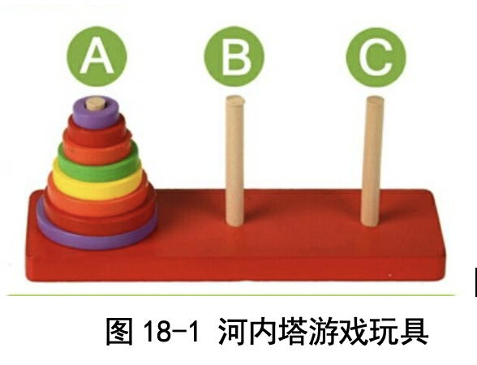
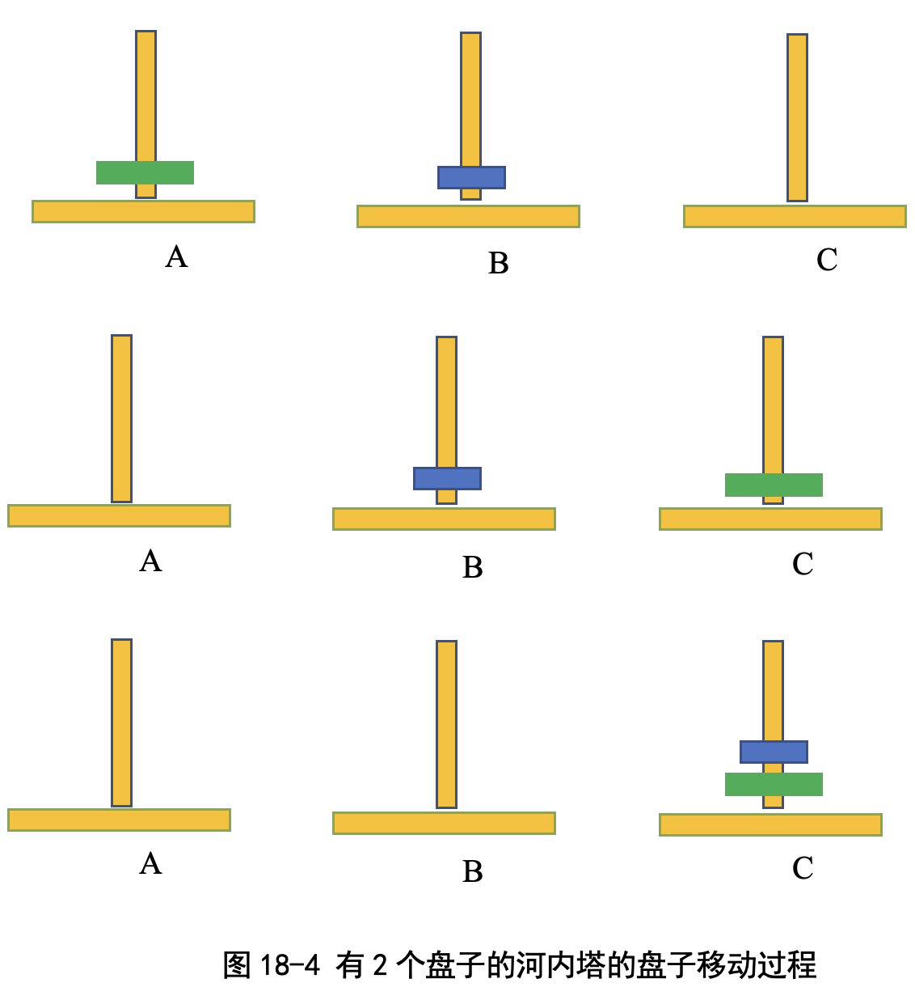
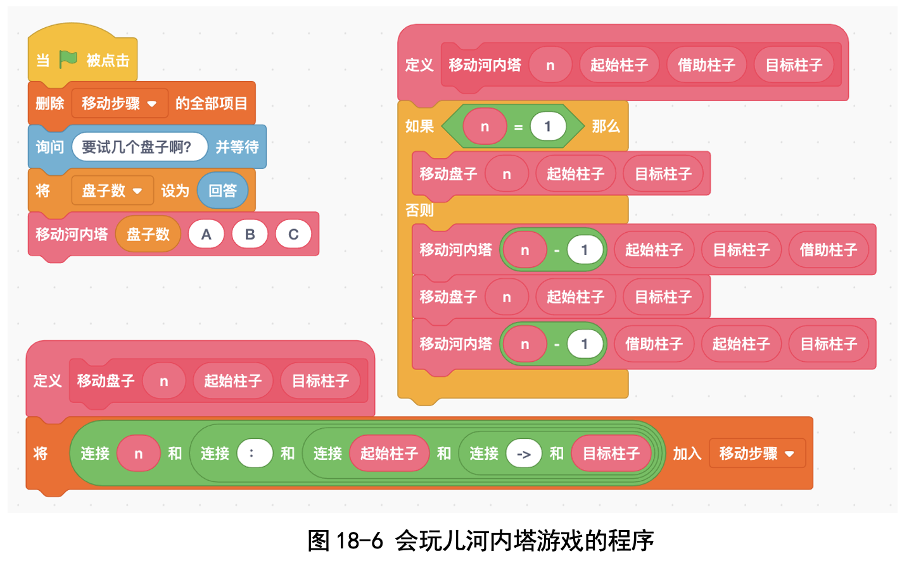
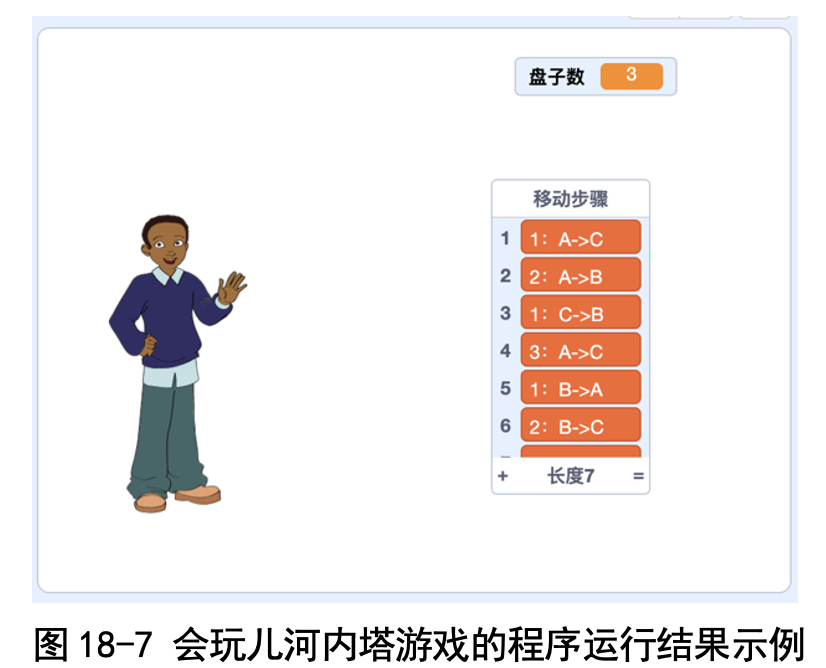
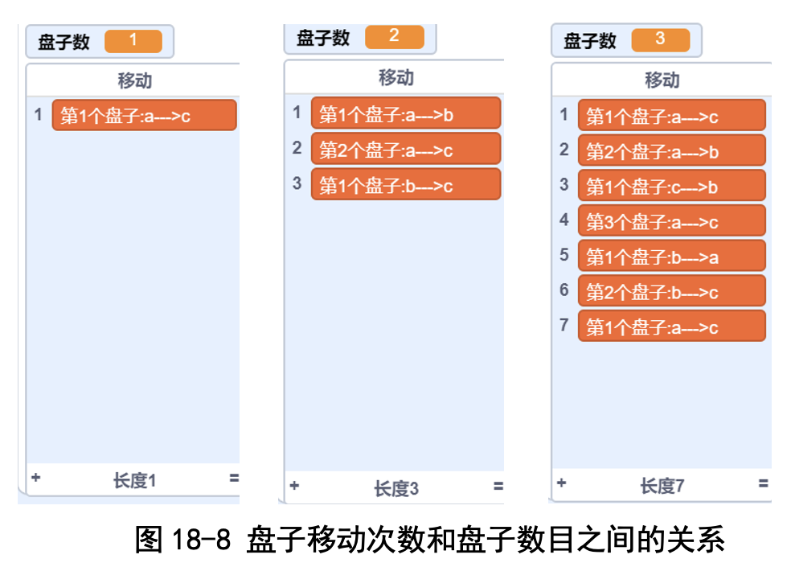

# 第18讲 玩游戏体会“递归法”：河内塔游戏

## 一、实验目的
我们在玩具店里会看到一款叫“河内塔”的玩具:有 A, B, C 三根柱子， 每根柱子上都穿着一些盘子(见图 18-1)。游戏的目的是让我们把 A 柱子上的 所有挪到 C 柱子上，但要求是:

(1)每次只能挪一个盘子。

(2)可以把盘子临时放到 B 柱子上。 

(3)始终得保持小盘子在大盘子上方，不能把一个大盘子放到小盘子
上面。 

今天我们就写一个程序，把挪盘子的过程给算出来。这个程序里要用到一
种特殊的积木块，叫作“递归积木块”，就是自己调用自己的积木块。这有一 点挑战性哦，我们开始吧!

## 二、背景知识

### (一)河内塔的故事

法国数学家爱德华·卢卡斯曾讲述过这样一个故事:相传越南首都河内的 一个寺庙里有一块黄铜板，上面插着三根宝石针。主神在创造世界的时候，在 其中一根针上穿了 64 个金盘子。这些盘子小的在上面，大的在下面，像个宝 塔，称为“河内塔”(有的书上音译为“汉诺塔”)。

寺庙里的僧侣不分白天黑夜地移动这些金盘子:一次只移动一个盘子;不 管在哪根针上，大盘子不能在小盘子上面。

### (二)什么是递归积木块?

我们在写积木块时，积木块里面可以调用别的积木块。那如果这个积木块 自己调用自己，会发生什么情况呢?包老师告诉我们:如果一个积木块调用自 己的话，就是递归。
自己调用自己?这听起来有点绕，我举两个例子你就明白了。先看这段话:

***森林里有一朵红玫瑰和一朵白玫瑰。一天，红玫瑰给白玫瑰讲故事，讲的 是:“森林里有一朵红玫瑰和一朵白玫瑰。一天，红玫瑰给白玫瑰讲故事。讲 的是:‘森林里有一朵红玫瑰和一朵白玫瑰。一天，红玫瑰给白玫瑰讲故事。 讲的是:......’”*** 

再看图 18-2。这幅图中左侧是一个盒子，盒子里是一个侍女端着一个盒 子，那个盒子里还是那个侍女端着一个盒子......还有俄罗斯套文，一个套着一 个。现在你懂什么是递归了吧?

## 三、基本思路
卜老师一直叮嘱我们做事情要从最简单的情况开始思考，这次也一样:有 64 个盘子的河内塔对我们来说太难了，我们不会玩儿，于是我们先考虑 1 个 盘子，再考虑 2 个盘子，然后是 3 个盘子，这样逐渐增加。

### (一)最简单的情形:1 个盘子

这种情形下直接把盘子从 A 挪到 C 就行了，如图 18-3 所示。

### (二)比较简单的情形:2 个盘子

我们先看最大的那个绿色盘子:最终我们需要把这个绿色盘子从 A 挪到 C，但是绿色盘子上面有一个蓝色盘子，所以我们得先把蓝色盘子挪到别的地 方才能挪绿色盘子。

那这个“别的地方”是哪里呢?想一想就能明白，肯定不能是 C 柱子(否 则把蓝色盘子放到 C 柱子之后，上面就无法放大号的绿色盘子子)，那只能是 B 柱子了，所以步骤就是:

先把蓝色盘子从 A 挪到 B， 

然后把绿色盘子从 A 挪到 C， 

最后把蓝色盘子从 B 挪到 C(见图 18-4)。

### (三)难一点的情形:3 个盘子

......

详细内容请看书的第18讲。

### 代码下载

[河内塔游戏的代码](Code/第18讲-河内塔.sb3) 

## 六、实验结果

图 18-9 中是我的程序打印出来的 3 个盘子的移动步骤，很棒吧!

### (一)输入不同的 n，验证移动次数
我输入少一点的盘子数，程序算出来的结果和我自己手工移动的结果是相 同的。的确是 1 个盘子需要 1 步，2 个盘子需要 3 步，3 个盘子需要 7 步(见图 18-10)，移动几个盘子，需要移动的步数就是 2 的几次方减去 1。

### (二)要是有 64 个盘子呢?
我输入 n=64，结果程序一直在运行，晚上还没有结束，我还是关机吧。 

## 七、思考与延伸
如果有 A，B，C，D 共 4 个柱子以及 64 个盘子，那么把盘子全部从 A 柱 子移到 D 柱子，最少需要移动多少次?

## 八、教师点评
河内塔是经典游戏，是用来说明“递归”过程的好例子。

在讲解这个问题的时候，我们还是重点强调“从最简单的做起”，把挪 3 个盘子的任务分解成两次挪 2 个盘子的任务，这样孩子们就很容易掌握了。

[返回上级](index.md)
