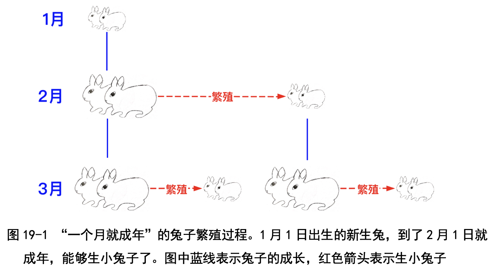
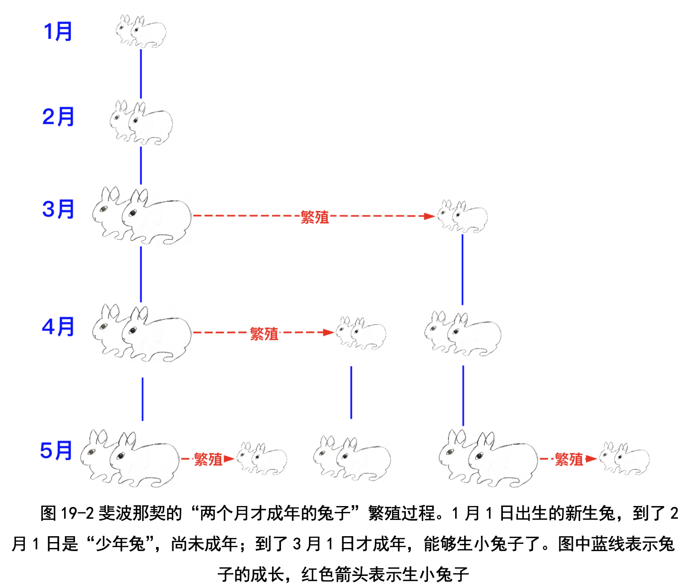
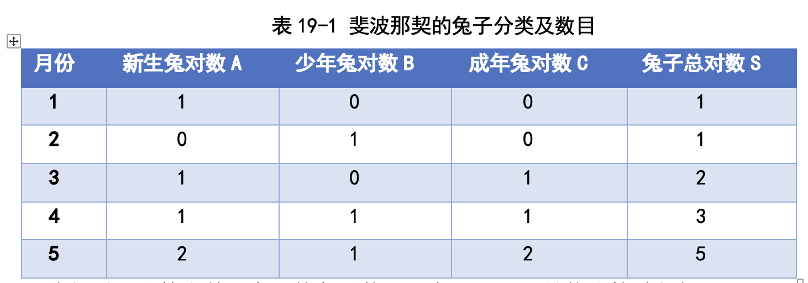
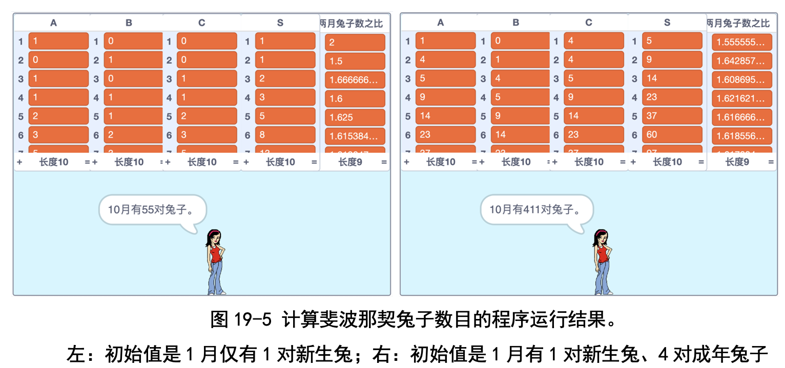

# 第 19 讲 “递归法”的应用:斐波那契数列与黄金分割

## 一、实验目的

我们来看一个有趣的故事:设想在今年 1 月 1 日，有人送给你一对刚出生 的小兔子;兔子生长得很快，这里假设一个月后兔子就成年，能够生小兔子了; 一对成年兔子每个月会生下一对新兔子。请问到 12 月 1 日，你家里有多少对 兔子?

这个问题很简单。我画了一幅兔子繁衍图(见图 19-1)，你一看就明白了: 

(1)1 月 1 日有 1 对新生兔子;

(2)到了 2 月 1 日，这对兔子成年了，生下一对小兔子，所以共有 2 对
兔子;

(3)到了 3 月 1 日，这 2 对兔子(不管是已成年的兔子，还是新生兔)都
长了一个月，都是成年兔了，所以会各自生下一对小兔子，这样我们就有 4 对 兔子;

(4)类似地，到 4 月 1 日，这 4 对兔子会生下 4 对小兔子，这样共有 8 对 兔子。

咱们按月份把兔子的数目列出来，就是 1，2，4，8，......，每个月的数 量都是上一个月的两倍(老师说这样的数列叫作“等比数列”，就是后一个 数和前一个数之间的比例始终相等)。按照这个规律，到了 12 月 1 日，会有 2048 对兔子。

斐波那契把这个生小兔的问题改了一下:新生兔子不是一个月后就成年， 而是两个月后才成年;成年之后，还是每个月都会生下一对小兔子。问题还是 一样的:到 12 月 1 日，你家里会有多少对兔子呢?

这个问题可就难了:直观地想，和一个月就成年的兔子比起来，两个月才 能成年的兔子肯定繁衍得慢。不过怎样才能算出兔子的具体数目呢?没关系， 咱们还是画兔子繁衍图吧，如图 19-2 所示。

(1)1 月 1 日只有 1 对新生兔子;

(2)到了 2 月 1 日，这对兔子长大成“少年兔子”，不过还未成年，没有 生小兔子，所以还是只有 1 对兔子;

(3)到了 3 月 1 日，这对兔子成年了，生了一对兔子，所以共有 2 对兔子;

(4)到了 4 月 1 日，最老的那对兔子又生了一对兔子，但是 3 月出生的那 对兔子只是长大成“少年兔子”，没有生小兔子，所以共有 3 对兔子;

(5)到了 5 月 1 日，最老的那对兔子又生了一对兔子，4 月出生的那对兔 子长大成“少年兔子”，但是没有生小兔子，3 月出生的那对兔子成年了，生 了一对小兔子，所以共有 5 对兔子。

这些兔子数目的数列 1, 1, 2, 3, 5, ......叫作“兔子序列”，也叫作“斐波那 契数列”。我们编程来算一下这个数列吧!

## 二、背景知识

### (一)斐波那契是谁?什么是斐波那契数列?

斐波那契(Leonardo Fibonacci)是意大利数学家， 1175 年出生在一个富商家庭。我查了一下，1175 年是 中国的南宋时期，斐波那契和辛弃疾可以算是同一个年 代的人。

当时欧洲的商人为做生意而四处旅行，曾到过 西西里、埃及和叙利亚，因此接触到阿拉伯数字及“位 值记数法”。(我们在辅助材料中“进制转换”那一讲里， 会详细讲解位值记数法。)

斐波那契发现十进制记数系统比罗马数字更利于计算，从而将阿拉伯数字 和位值记数法引入欧洲，替代了罗马数字。

他在 1202 年的著作《计算之书》中提出了“生小兔问题”，引发出了一个 充满奇趣的斐波那契数列。斐波那契数列与黄金分割、杨辉三角等数学规律有 关，还和植物生长等自然现象有关。卜老师还告诉我们，著名的数学家华罗庚在“优选法”中也使用了斐波那契数列。

......

其他内容请见书中第19讲。

## 三、基本思路

我们先把题目中的兔子分一分类:

● 新生兔:刚刚出生、不足 1 个月大的兔子叫作“新生兔”。

● 少年兔:满了一个月，但是不到两个月大的兔子叫作“少年兔”。

● 成年兔:大于两个月的兔子叫作“成年兔”。成年兔可以生小兔子。 这样只需要算出每个月新生兔、少年兔、成年兔的对数，加起来就是这个
月的兔子总数了。我们用列表表示每个月的兔子数目:

● 列表 A :记录新生兔子对数，其中 A1 表示 1 月份新生兔子的对数，A2
表示 2 月份新生兔子的对数，其他 A3, A4 等依次类推。

● 列表 B :记录少年兔子的对数，其中 B1 表示 1 月份的少年兔子对数，
B2 表示 2 月份的少年兔子对数，其他 B3, B4 等依次类推。

● 列表 C :记录成年兔子的对数，其中 C1 表示 1 月份的成年兔子对数，
C2 表示 2 月份的少年兔子对数，其他 C3, C4 等依次类推。

● 列表 S :记录兔子总数，其中 S1 表示 1 月的兔子总数，S2 表示 2 月份
的兔子总数，其他 S3, S4 等依次类推。

我们手工计算出前 5 个月的兔子数(见表 19-1)，具体计算过程如下:

● 成年兔子对数 C 的计算方法:上月的成年兔到这个月还是成年兔;上月的少年兔到了这个月就成了成年兔，因此，本月成年兔的对数等 于上个月的成年兔的与少年兔对数之和。比如 2 月份的成年兔对数 C2=B1+C1=0，3 月份的成年兔对数 C3=B2+C2=1。

● 新生兔对数 A 的计算方法:本月的一对成年兔能够生一对小兔子， 因此本月的新生兔对数就是成年兔的对数。比如 2 月的新生兔对数 A2=C2=0，3 月的新生兔对数 A3=C3=1。

● 少年兔子对数 B 的计算方法:上个月的新生兔到了本月，就长大成少年 兔，因此，少年兔的对数就是上个月的新生兔对数。比如 2 月的少年兔 对数 B2=A1=1，3 月的少年兔对数 B3=A2=0。

了解了这些规律，我们就好写程序了。

按照基本思路里所说的，我们要算某个月份的兔子总数，只需要计算出这个 月份的新生兔子数目以及成年兔子数目就可以了，相应的程序如图 19-4 所示。

### 代码下载及Web版

点击[斐波那契数列-大中小三类兔子](Code/第19讲-斐波那契数列-大中小三类兔子.sb3)下载于本地运行，或点击[斐波那契兔子Web版](https://scratch.mit.edu/projects/683358769/)直接运行

点击[斐波那契数列-大中中小四类兔子](Code/第19讲-斐波那契数列-大中中小四类兔子.sb3)下载于本地运行，或点击[斐波那契兔子Web版（3个月才成年）](https://scratch.mit.edu/projects/683359376/)直接运行

## 五、实验结果及分析
我算了 10 个月的兔子数目，分别是 1 月 1 对、2 月 1 对、3 月 2 对、4 月 3 对、5 月 5 对、6 月 8 对、7 月 13 对、8 月 21 对、9 月 34 对、10 月 55 对; 相邻月份兔子数目之比从 2，1.5，1.66，1.60，1.625，1.615，1.619 变到 1.617， 越来越接近 1.618(见图 19-5 左图)。左侧是初始值是 1 月仅有 1 对新生兔;右侧是初始值是 1 月有 1 对新生兔、 4 对成年兔子。

从图中可以看出，即使斐波那契把兔子的成年期改成两个月，兔子数目依然接近 一个等比数列，虽然不再是每月增长 2 倍，但依然增长得很快。

## 六、思考与延伸
改变 1 月份的兔子数，会影响相邻两个月的兔子数目之比吗?老师告诉我 们:黄金分割比非常稳定，跟一开始的兔子数目关系不大。

为了验证这一点，我修改了一下程序，把 1 月的新生兔子设成 1 对，成 年兔子设成 4 对，发现相邻两月的兔子数目之比还是越来越接近 1.618(见 图 19-5 右图)，真的跟一开始有几只兔子没关系啊!

## 七、教师点评
斐波那契数列是非常重要的序列，能够串起很多知识点，比如递归关系、 产生函数、黄金分割、优化算法等。

传统的讲法是直接讲“两个月成年”的兔子，不过这样不好扩展，也不容 易认清斐波那契数列的关键。我们没有采用传统的讲法，而是从“一个月就成 年”的兔子讲起，这样的兔子数目逐月增长 2 倍，孩子们特别容易理解;然后 再讲斐波那契的“两个月才成年”的兔子，才能让孩子们更清楚地理解斐波那 契的用意，还能将思路扩展到“三个月才成年”的兔子的问题。

### (一)如果兔子要 3 个月才成年呢?
在这一讲的一开头，我们讲的是“一个月就成年”，对这样的兔子来说， 下一个月的兔子数目是上月兔子数目的 2 倍。斐波那契把兔子改成了“2 个月 才成年”，对这样的兔子来说，下一个月的兔子数目越来越接近于上月兔子数 目的 1.618 倍。

咱们再扩展一下，把兔子改成“3 个月才成年”，那兔子数列会变成什么 样子呢?把程序改了一下，算出来兔子的数目依然接近于一个等比数列:相邻 两月数目之比接近于 1.465，比斐波那契兔子那个黄金分割比 1.618 又小了一 点儿。1.465...是不是一个新的无理数呢?感兴趣的小朋友，你也想办法改一 改程序，算算看。

我们不妨再把斐波那契的兔子扩展一下:假如兔子 4 个月才成年呢? 5 个 月才成年呢?会不会又得到一些新的无理数呢?小朋友们试一试吧!

在这一讲里，我们还向孩子们补充了一些知识，请参见书中第19讲。

[返回上级](index.md)
