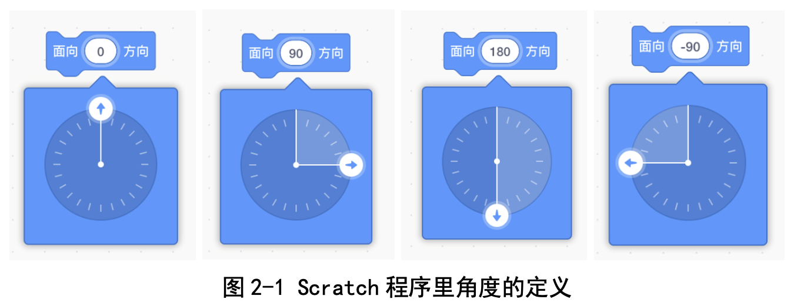
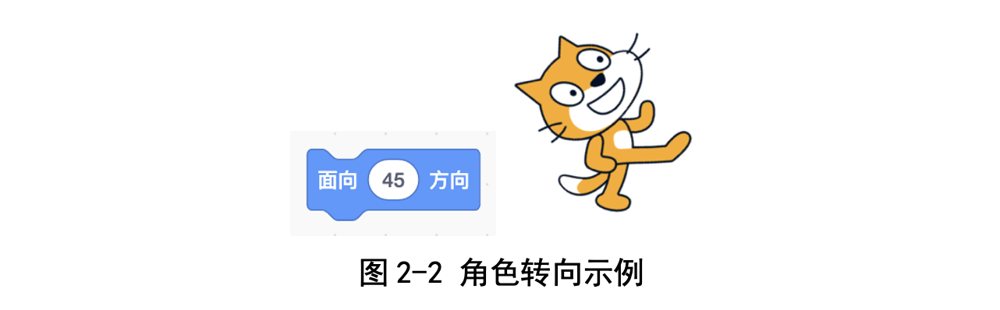
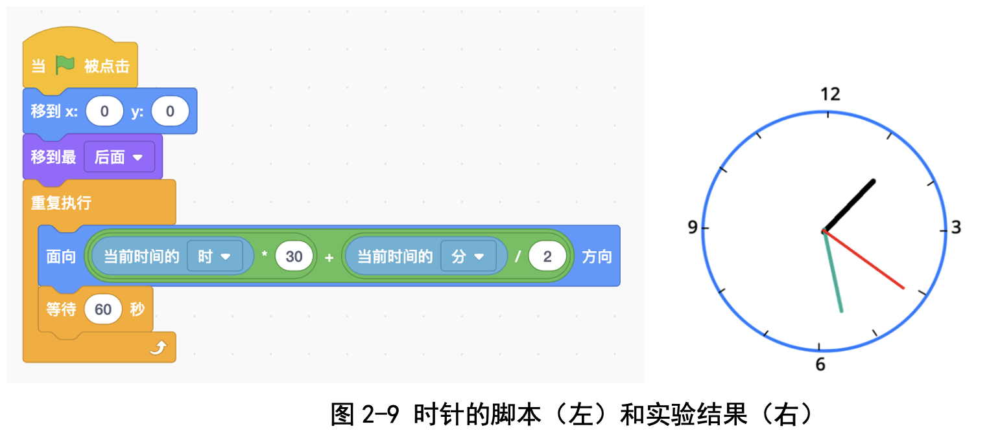
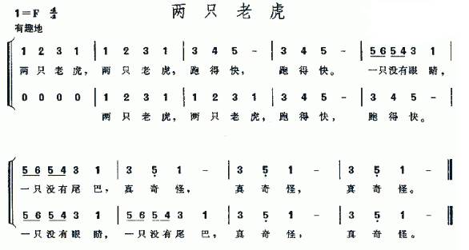
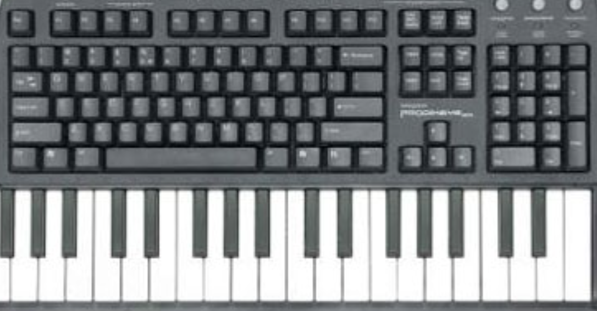

# 第2讲 角色的动作、绘图和音乐演奏

## 一、	知识点

在上一讲，我们学习了角色的一些基本动作；在这一讲里，我们再多介绍一些。

**（1）	角色的方向** 

人站在地面上，可以面朝东、西、南、北等不同的方向。Scratch里的角色也一样，也可以面向上、下、左、右不同的方向；这只需要指定面向角度就可以了，记住一圈是360度啊（图2-1）。

卜老师特别提示我们说，在数学里通常采用的定义是：右方是0度，然后沿着逆时针方向增加角度；Scratch采用了不同的定义：上方是0度，沿着顺时针方向增加角度。

如果想面朝右上方，那执行图2-2里的这条指令就可以了。

**（2）	角色的变换造型**
......
详细内容请参见书的第2讲。

## 二、动手练

**实验一：** 一只走动的钟表

**实验目的：** 

做一个走动的钟表，指针每秒转动一格，分针每分转动一格，时针每小时转动一格。

**代码下载** 

[一只会走动的钟表代码](Code/第2讲-会走的钟表.sb3) 

--- 

**实验二：** 音乐演奏

**实验目的：** 

写程序让小猫自动演奏《两只老虎》乐曲

**代码下载** 

[演奏《两只老虎》的代码](Code/第2讲-两只老虎.sb3) 

---
**实验三：** 用计算机键盘弹钢琴

**实验目的：** 

用计算机键盘模拟钢琴键盘，把计算机变成一台简易钢琴。

当我们按下1键，发出Do的音；当按下2键，发出Re的音；当按下3键，发出Mi的音；当按下4键，发出Fa的音；当按下5键，发出Sol的音；当按下6键，发出La的音；当按下7键，发出Xi的音；当按下8键，发出高音Do的音。

**代码下载** 

[用计算机键盘弹钢琴的代码](Code/第2讲-钢琴.sb3) 

## 四、教师点评
第二堂课的目的是继续讲授角色的基本动作，扩展到了画笔和音乐演奏。用画 笔模块，能够快速画出图形;用音乐模块，能够演奏乐曲，这使孩子们很有兴趣。

从这一堂课起，我们讲实验的时候总是分成“实验目的、基本思路、编程 步骤、实验结果、遇到的 bug 及改正过程”5 大环节来讲解，孩子们比较容易 理解，也能够按照这个来做笔记和总结。

我们还留下一个“思考和延伸”小节，供孩子们自由发挥;有时候孩子们 写出来的东西出乎大人的意料。

[返回上级](index.md)

