# 第 25 讲 博弈初探: 会下 tic-tac-toe 棋的阿尔法小狗

## 一、实验目的

我们平时老说“阿尔法狗”，它可不是一条狗，而是一个计算机程序，名 字叫 AlphaGo，“阿尔法狗”是它的音译。这个程序会下围棋，而且非常厉害， 是第一个击败人类职业围棋选手、第一个战胜围棋世界冠军的程序。

这个程序怎么那么厉害呢?卜老师告诉我们阿尔法狗用了很多人工智能技 术，包括神经网络、智能搜索等。

我们现在还不会用 Scratch 写神经网络，做不了阿尔法狗，就先写一个简 单的会下 tic-tac-toe 棋的“阿尔法小狗”吧，等我们长大了再写会下围棋的阿 尔法大狗。

## 二、背景知识

### (一)什么是 tic-tac-toe 棋游戏?

tic-tac-toe 棋又叫“井字棋”(见图 25-1)，因为棋盘有两横两竖，像个 “井”字，也叫“○ × 棋”，因为共有两种棋子，一种是○，另一种是 ×。
这个棋的规则是这样子的:

● 棋盘:我们在纸上画个“井”字，横着两道线、竖着两道线，共分成 9
个格子。

● 棋子:设置两种棋子，一种是○，一种是 × ;我们规定让拿 × 的棋手 先下。

● 走法:两人轮流走子，要把棋子放到格子里，而不是像下围棋一样放在 交叉点上。

● 胜负:一方有 3 枚棋子占据了同一行、同一列，或者一条对角线，就算 胜利。

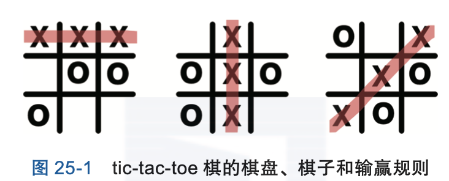

### (二)人是怎样下棋的?

tic-tac-toe 棋这个游戏很多小朋友都玩过。我们来回想一下是怎样玩的:假设对 手拿 ×，第一手先下到中心格子;我们拿○，该怎样下呢?还有 8 个格子，在哪 里落子赢面最大呢?这里的赢面，就是“赢的可能性”的意思。我们用一个分数 表示赢面的大小，分数越大，赢的可能性就越大;分数越小，赢的可能性就越小。

在图 25-2 所示的例子中，下在左上角赢面是 2 分，下在上面中间格子的 赢面是 1 分，...，下在右下角赢面是 2 分，那么我们第 2 手肯定下在赢面最大 的格子，就是 1 号位或 9 号位。

那关键就是对每一种可能的尝试都算出来一个“赢面”大小来了。不同的 人下棋之所以不一样，就是大家对棋局的“赢面是多少”所持的看法不一致。

我们下棋的时候，判断某种走法的赢面主要靠下面两种方法:

● ***凭直觉:*** 有时候我们就是凭经验、凭直觉，觉得就是下在哪里好，根本
说不清楚道理，有时候就是蛮不讲理。

● ***靠尝试:*** 我们还可以尝试，就是试着把 O 下到左上角，然后思考对手
会怎么走，再试着把 O 下到其他位置，思考对手会怎么走。

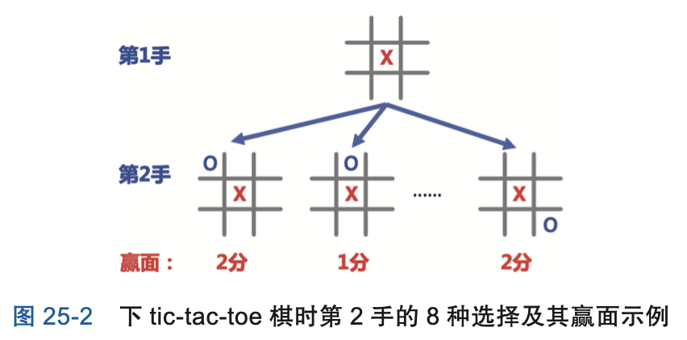

## 三、基本思路

### (一)阿尔法小狗怎样表示棋局?

下棋的时候，双方在不同的格子里落子，形成的棋局千变万化。怎么样在 程序里表示出来，好让计算机能明白呢?

我们首先对棋盘的格子进行编号:第一行三个格子是 1，2，3 号，第二行 是 4，5，6 号，第三行是 7，8，9 号;然后，我们用一个包含 9 个整数的列表 表示每个格子上到底被谁占据:如果是被阿尔法小狗占据，列表中对应的整数 项就是 1，被玩家占据就是 -1，没被占据就是 0。

以图 25-3 所示的棋局为例，1 号格子被玩家占据，用 -1 表示;2 号格子 是空的，用 0 表示，其他格子依次类推，最后形成一个列表 [-1, 0, 1, 0, 1, 0, 0, 0, 0]。这是卜老师为我们设计的表示方法;这样表示的好处一会儿写程序时 就知道了。

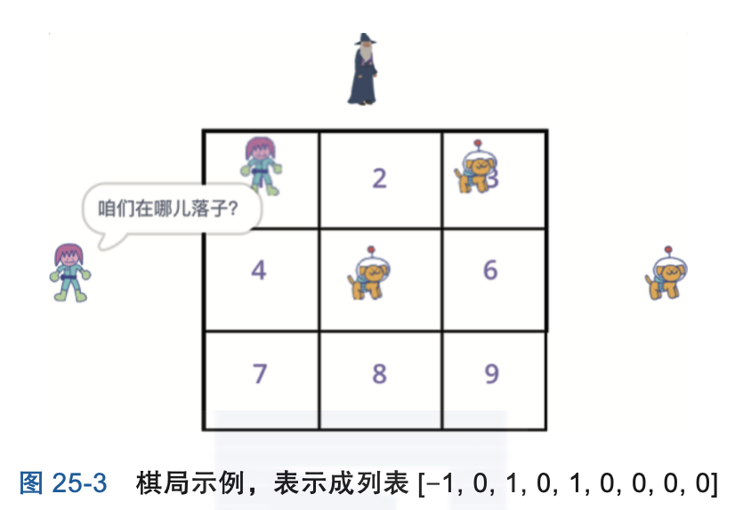

### (二)阿尔法小狗怎样判断下在哪里赢面大呢?
阿尔法小狗第 2 手有 8 种可选的位置，哪一种下法赢面最大呢?

以图 25-4 中阿尔法小狗尝试走 1 号位为例(见图 25-4 左侧)，小狗会这样 想:如果我下在 1 号位的话，第 3 手玩家有 7 种应对方法(下在 2, 3, 4, 6, 7, 8, 9 号位);玩家肯定会下他“最厉害的招数”，让我赢不了。

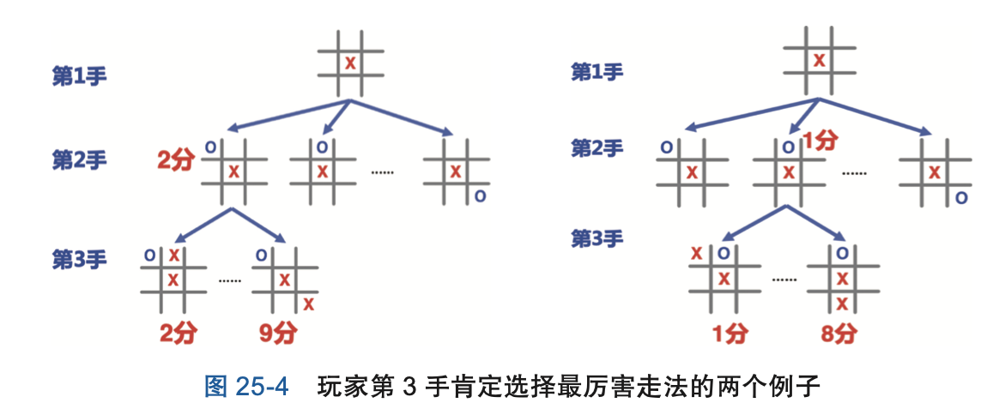

假如我们能够给棋局一个打分，表示“这个棋局对阿尔法小狗是有利还是 不利”，分数越高表示对小狗越有利、对玩家越不利，分数越低表示对玩家越 有利、对小狗越不利。这样的话，阿尔法小狗枚举第 3 手玩家的所有 7 种走 法，每一种走法都打了一个分数，玩家“最厉害的走法”就是选打分最低的 走法。

比如玩家第 3 手走 2 号位，阿尔法小狗对棋局的评分是 2 分;玩家走 9 号 位的话，棋局评分是 9 分。那么玩家肯定走 2 号位，这样给阿尔法小狗造成的 困难最大。因此，阿尔法小狗“第 2 手尝试走 1 号位”的赢面是 2 分，也就是 第 3 手所有棋局评分的最小值。

小朋友们，这个地方有点儿绕，你看明白了吗?要是还觉得困惑的话，咱 们再看一个例子吧，如图 25-4 右侧所示。

● 假如第 2 手阿尔法小狗尝试走 2 号位，玩家第 3 手也是有 7 种应对走法 (走 1, 3, 4, 6, 7, 8, 9 号位)。

● 阿尔法小狗枚举这 7 种走法，每一种棋局都给一个评分，比如玩家走 1 号位打 1 分，玩家走 8 号位打 8 分。

这样玩家肯定走他最厉害的走法，就是走 1 号位。因此，阿尔法小狗“第 2 手尝试下在 2 号位”的赢面是 1 分。

### (三)阿尔法小狗怎样下棋呢?

阿尔法小狗会计算棋局评分和赢面之后，下棋就简单了，就是不断执行这两步: 

(1)***算第 3 手的棋局评分的最小值:*** 对第 2 手的每一种尝试，都枚举玩家 第 3 手的可能走法，然后计算出棋局评分，找出最小值来，就是“玩家最厉害
的走法”;这个最小棋局评分就是阿尔法小狗这种尝试的“赢面”。

(2)***算第 2 手的赢面的最大值:*** 阿尔法小狗对每一种尝试都算出“赢面”
来，最后按赢面最大的走法下棋就行了。

如图 25-5 所示，下棋就是“一步算最小、一步算最大”，很有规律吧?

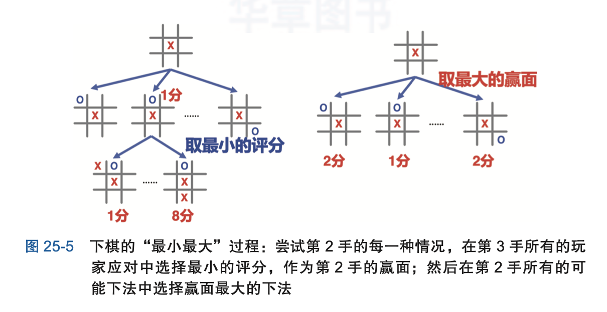

###  (四)阿尔法小狗怎样对棋局进行评分呢?

### （五）阿尔法小狗要“深谋远虑”还是“目光短浅”?

刚才阿尔法小狗第 2 手尝试每一种走法，然后只考虑玩家第 3 手的应对， 是一只“目光短浅”的阿尔法小狗。平时父母长辈们总是告诫我们要“深谋远虑”，不要“目光短浅”。那能不能让阿尔法小狗“深谋远虑”呢? 要想赢棋，不能只思考对手第 3 手怎么走，还得考虑我第 4 手怎么应对，
对手第 5 手怎么走，我第 6 手怎么应对......想得越深、越全面，赢棋的把握越
大。这是古语说的“多算胜、少算不胜”，还有“深谋远虑”。如图 25-6 所示， “深谋远虑”型阿尔法小狗是这样考虑问题的(见图 25-6):

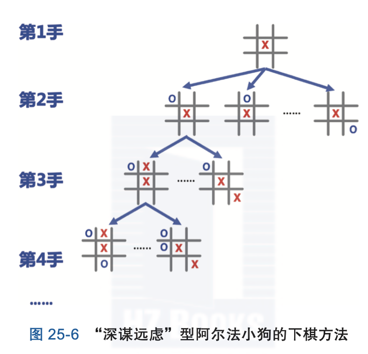

可是这样的话，阿尔法小狗得枚举多少次呢? 请参见书中第25讲。

看来要让阿尔法小狗“深谋远虑”的话，也得适可而止啊。卜老师带我们
写的这个阿尔法小狗，就是一只“目光短浅”型小狗;要写一只“深谋远虑” 型小狗，下 tic-tac-toe 棋的话普通计算机或许够用。卜老师说对围棋那样复杂 的棋类游戏来说，枚举算法再大的计算机也吃不消，必须想办法“枚举 + 剪 枝”。阿尔法大狗就是想办法尽可能地对搜索树进行剪枝。

### 过程描述

#### (1)裁判的主程序 

一开始，裁判宣布“人机大战开始了”，然后就画棋盘;然后广播“请玩
家走棋”消息，通知玩家走棋，广播“请阿尔法小狗走棋”消息，通知阿尔法 小狗走棋。每走完一步，就判断一下是否已经确定输赢了(见图 25-7)。

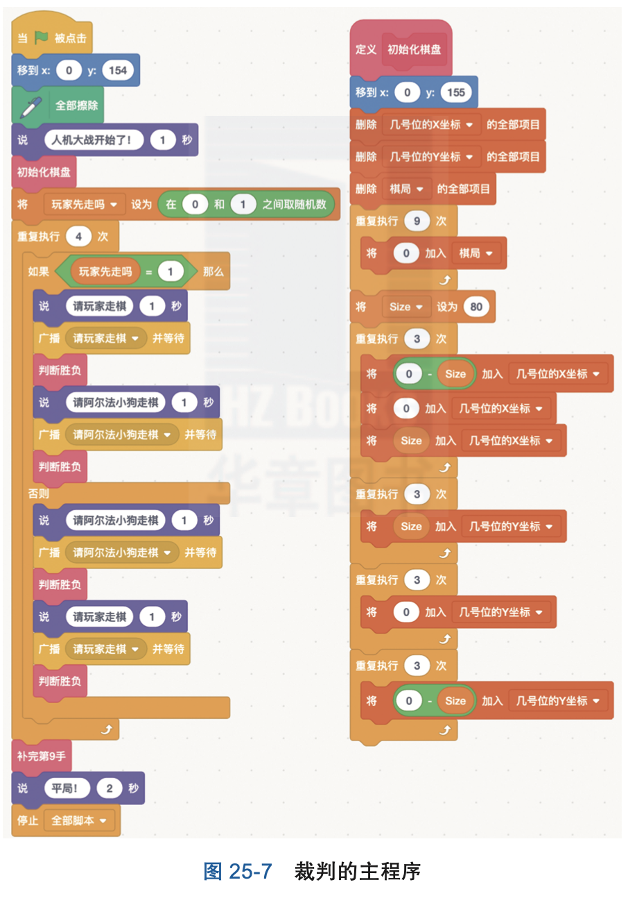

#### (2)玩家的主程序 

玩家的程序很简单:收到“请玩家走棋”消息时，询问玩家在哪里落子，然后把棋局列表中的数据项改成 -1 即可(见图 25-9)。

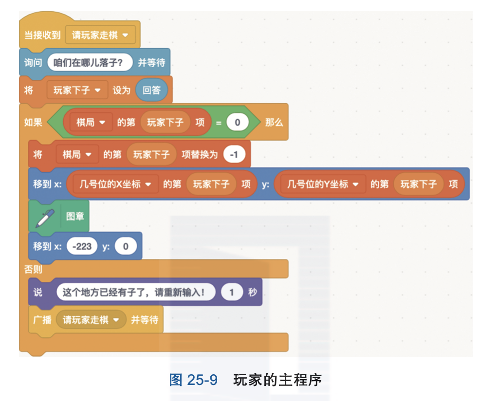

#### (3)阿尔法小狗的主程序 
阿尔法小狗收到“请阿尔法小狗走棋”消息时，计算最优的落子，把棋局
中最优落子对应的项改成 1(见图 25-10)。

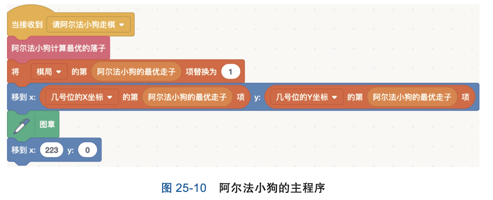

那阿尔法小狗怎样计算最优的落子呢?小狗得枚举所有可能的尝试，对每 一种尝试再往前看一步，猜测玩家最厉害的应对(见图 25-11)。

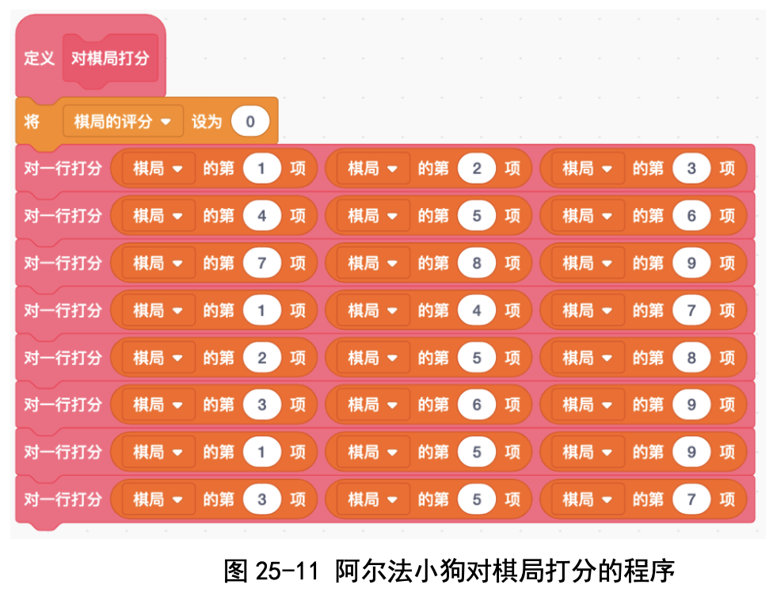

阿尔法小狗对棋局打分，是按照行、列和对角线来分别打分，最后把所有 行、列、对角线的打分加起来(见图 25-12)。

在对一行、一列或者一条对角线打分时，卜老师设计了一个简洁的方法: 先算一行、一列或一条对角线上三个格子里的数字之和。这个“三格数字之 和”能够大大减少枚举棋局的次数(见表 25-1)。然后，根据三格数字之和对 一行、一列或者一条对角线打分。最后，把所有行、所有列、所有对角线的打 分累加起来，就是棋局的打分(见图 25-13)。

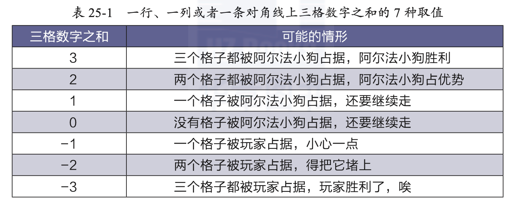

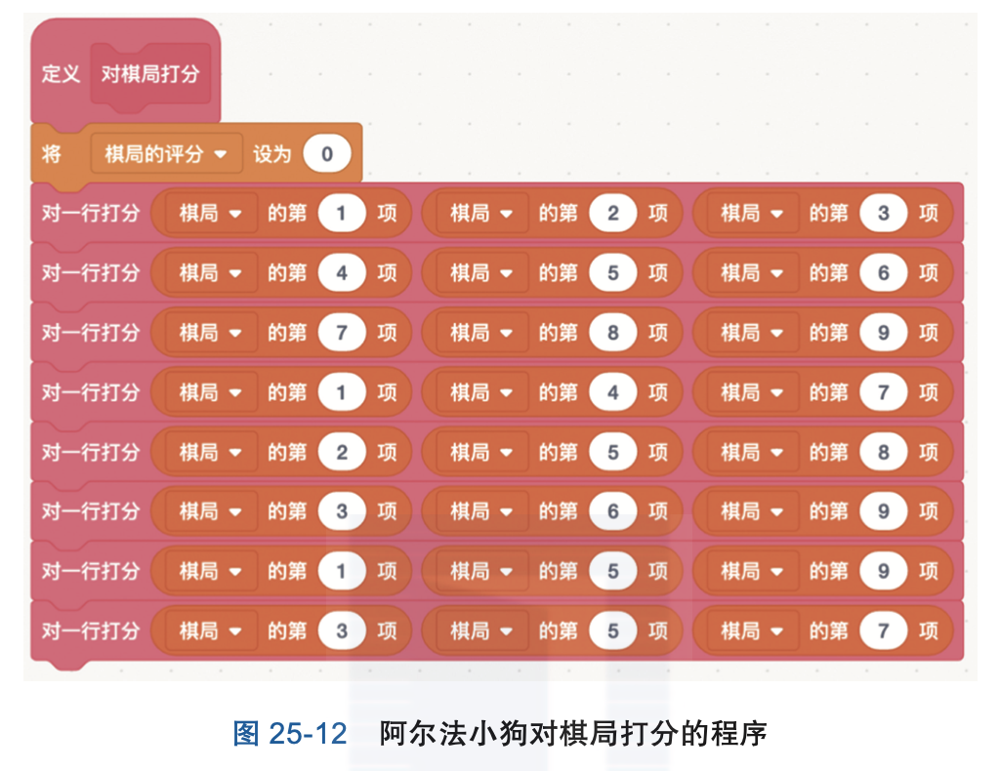

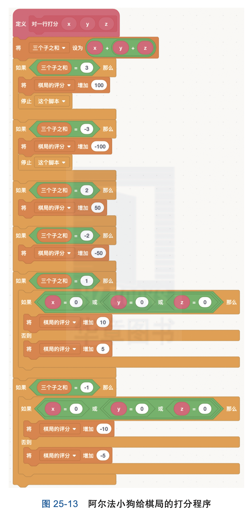

### 代码下载及Web版

点击[阿尔法小狗的代码](Code/第25讲-阿尔法小狗.sb3)下载于本地运行，或点击[阿尔法小狗Web版](https://scratch.mit.edu/projects/683365064/)直接运行

## 六、实验结果

下面是我和阿尔法小狗“人狗大战”的对局过程。我走先手，走 3 号位; 阿尔法小狗算出来走 5 号位赢面最大，就走了 5 号位(见图 25-16)。

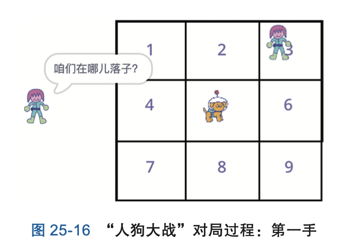

接下来我走 2 号位，想把第 1 行连成一条线，就赢了。可是阿尔法小狗很 聪明，马上算出来它得走 1 号位，堵上了，让我连成一条线的梦想破灭了(见 图 25-17)。
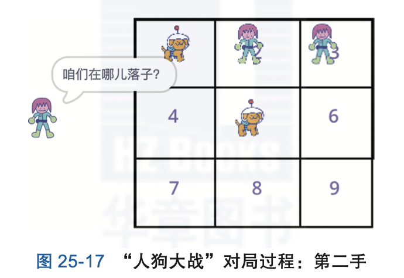

危险!我得赶紧走 9 号位，要不然小狗连成一条对角线就赢了。这时阿尔 法小狗走了 6 号位(见图 25-18)。

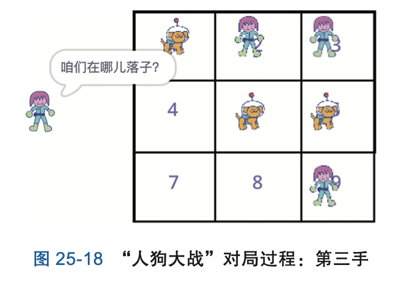

再次危险!我不得不走 4 号位，堵上阿尔法小狗所在的第 2 行空位(见 图 25-19)。阿尔法小狗算出来最优走子是走 7 号位，那我只有 8 号位 1 个格 子可以走了。平局收场!

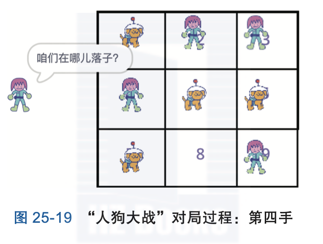

这只阿尔法小狗还是挺聪明的嘛!我们好几个人都没下过它。直到一年以 后，新来的小 SIGMA 李济杉小朋友偶然发现了一种下赢阿尔法小狗的方法。 你也试试吧?

## 七、思考与延伸
### (一)怎样让阿尔法小狗变聪明?
让阿尔法小狗变聪明的办法有两种:第一种是你的程序有 bug，你要改 bug;第二种是对局面的打分方法不好，你要改打分方法。

比如我程序中的 bug 是我写错了列表导致，那么小狗会很傻，老是走错的 位置。当方法不对时会和 bug 不太一样，比如当阿尔法小狗一行已经占据两格 的时候，再占一格就胜利了，可是方法不对的阿尔法小狗会自己走自己的，根 本不在意已经有两个格了。
 
 
### (二)新玩法:“狗狗大战”
如果有多个人一起学的话可以来一场“狗与狗的对决”，也就是把你的玩 家走你的伙伴的狗走的位置。比如说 A 是你的玩家，而 B 是你的伙伴的狗， B 走到了格 5 号格子，那 A 就得走到 5 号格子，之后你的狗就会走到一个位 置，而你伙伴的玩家就得走到你的狗走的那个位置。这样就有了一个狗与狗的 对决。

比如说，我和小 A 进行了一场比赛，第 1 场比赛是我输了之后，我通过 检查程序发现我的程序有问题，第 2 场比赛我们战平了，第 3 场比赛我们又战 平了。理论上说，如果有一个人的狗战败了，那么说明你的狗存在一个 bug， 或者你的方法不对。

## 八、教师点评
AlphaGo 是这个世纪计算机科学领域最重要的进展之一，它使用的一系列 技术，比如 Monte Carlo 树搜索、强化学习等，是非常值得重视和学习的。

我们一直想带孩子们领略博弈的奥秘。真正的阿尔法狗太复杂了，于是我 们设计了一个会下 tic-tac-toe 棋的 Scratch 程序。事实上，这个程序也非常复 杂，比如里面的“最大 - 最小”算法，理解起来不容易。我们教了 3 次课，才 带着孩子们写完。

另一个想让孩子们领会的还是“枚举 + 剪枝”这个思想:枚举的好处是考 虑周全，但是如果简单地枚举所有落子的话，又会导致运算量太大。因此只枚 举那些重要的，把不重要的“剪”掉，我们希望孩子们能够领会的。

孩子们掌握得还不错:2021 年 5 月 22 日，小 SIGMA 数学特别兴趣组 7 位小朋友参加了中科院计算所的“公众科学日”活动，上台表演了如何用 Scratch 编程实现一只阿尔法小狗。孩子们在 300 位现场观众的注视下，在台 上编程实现阿尔法小狗，这次活动还由知乎课堂线上转播，有 35 万人收看
(见图 25-20)。

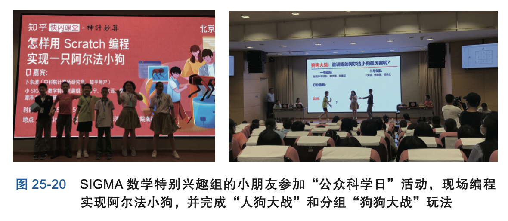

幸好我们事先准备充分，现场编程出了 bug，也顺利 debug 了。最后还分 成两个战队，每队用不同的棋局打分，比比谁的小狗厉害!能够完成现场编程 和讲解，表明孩子们基本上掌握了博弈的入门知识。

孩子们写程序实现的阿尔法小狗功能比较简单，而那只会下围棋的阿尔法 狗就复杂多了:围棋共有 361 个位置可以下子，所以要枚举的情况非常多，可 能的棋局形成的树非常大。那阿尔法狗怎样做到又快又好地搜索这棵树呢?它 还是用了“枚举 + 剪枝”这个思想，具体包括下面几个诀窍:

### (一)阿尔法狗的诀窍之一:控制树不能太高
阿尔法狗用了一个打分神经网络，直接算出来每种尝试的赢面是多大，这 样减少了模拟对局的次数，从而使得树不会太高(见图 25-21)。

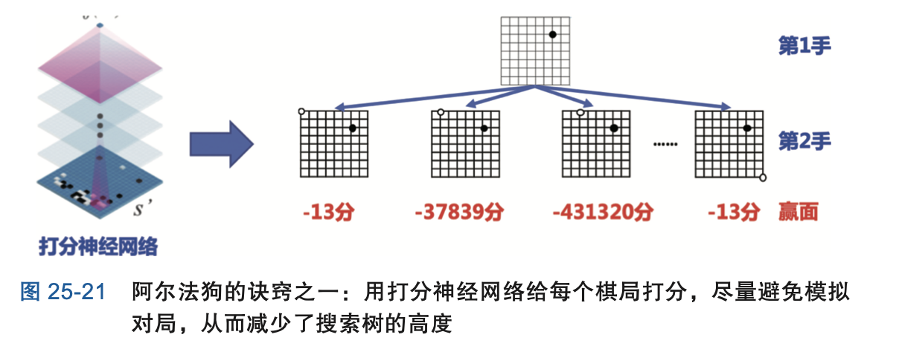

### (二)阿尔法狗的诀窍之二:控制树不能太宽
阿尔法狗还有一个走子神经网络，每次都会问这个网络往哪里下子最 好，不好的位置根本不考虑，这样树的分枝数目就减少了，树不会太宽(见 图 25-22)。

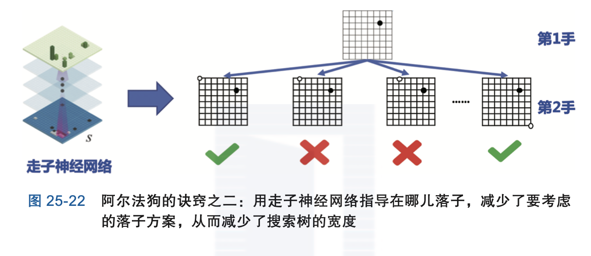

### (三)神经网络是怎样会打分和走子?
我们告诉孩子们，神经网络也是靠学习，才会知道怎样给棋局打分以及走 子(见图 25-23)。神经网络的学习方法也跟人一样，分为两类:

● ***跟高手学:*** 比如不会下的时候就去翻棋谱，看历史上吴清源九段碰到这 种情况会怎样下，我就怎样下。

● ***自学成才:*** 就是自己跟自己下，一方输了就反思，下次碰到这样的情况 不能再这么下了;赢了就加强，下次碰到这种情况还得这么下。

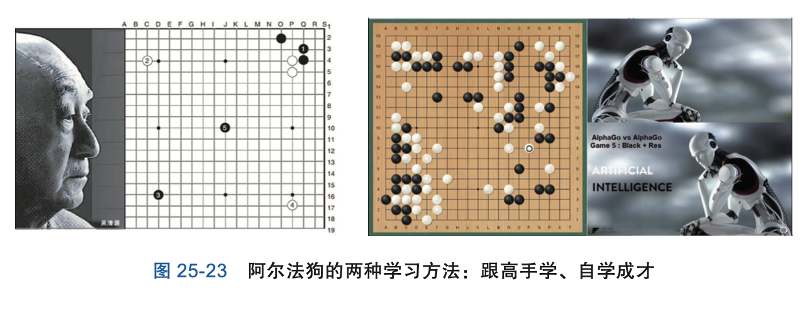

[返回上级](index.md)
