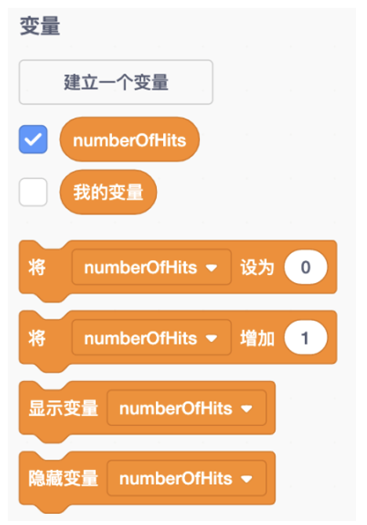
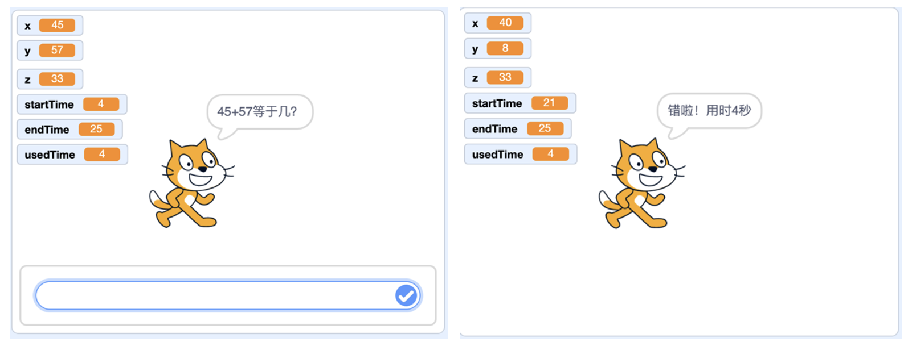

# 第三讲 变量：角色的记忆

## 一、	知识点

**（1）什么是变量？** 

角色想记录东西的时候，就要用到变量。

比如在第一讲的托球游戏里，球拍想记录总共打了多少个球，就可以创建一个变量“托了几次球”。游戏一开始的时候，我们设置这个变量的值等于0；然后每托了一次球，就把这个变量的值增加1；这样这个变量的值就是总共托了几次球啦！

变量变量，就是会变化的量。那啥变了呢？每个变量都有个名字，还会有变量的取值；名字不能变，只有值可以变。我觉得变量就像一个盛水的水杯，变量值就是里面的水，值的大小就是水的多少。

图3-1 Scratch中对变量的操作：建立变量、改变变量以及显示、隐藏变量

（2）变量名字的写法

变量的名字可以用中文，也可以用英文。如果用英文的话，那用大写英文字母还是小写英文字母呢？计算机程序里常用的规范是这样的：

•	变量名第一个单词首字母小写；

•	其它单词的首字母都要大写；

•	所有单词除了首字母其他字母都要小写。

比如用英文变量表示“托了几次球”，写成“numberOfHits”。这样高低起伏的看起来像骆驼峰一样，所以叫“驼峰”命名法。

**（3）	变量有几种？**

刚才我们讲的“打了几次球”变量，它的值可以是0，可以是1，还可以是2，3，4,……，总之都是整数。我们把这种变量叫整数变量。

要是想用变量表示小猫的名字的话，就不能用整数了。比如Scratch里默认的角色小猫叫“Sprite1”，是一串字母，我们
叫作字符串。还有其他种类的变量，比如布尔型（就是表示是否）等等；我们后面用到时再讲吧。

**（4）	什么是局部变量和全局变量？**
当角色建立一个变量时，可以让所有角色都使用，这样的变量叫“全局变量”。比如汤姆和杰瑞一起做了一些香肠；香肠的数目两人都知道，我们就可以把“香肠的数目”设置成全局变量。

我们也可以只让自己使用，这个叫作“局部变量”；比如说汤姆把香肠藏在“秘密位置”，这个位置不能让杰瑞知道，所以要用局部变量。

......

详细内容请见书中第3讲。

## 二、动手练

**实验一：** 给托球游戏加个计数器

**实验目的：** 

在第一讲里，我们做了一个托球游戏。现在我们给这个游戏加上一个计数器吧，数数我们能够坚持托几个球。

图3-2 带记数器的托球游戏（左）及实验结果（右）

**代码下载** 

[带计数器的托球游戏代码](Code/第3讲-带计数器的托球.sb3) 

--- 

**实验二：** 小猫出口算题

**实验目的：** 

小猫出加法口算题，比如56+98=? 然后让人来回答；小猫检查算得对不对。小猫还要计时，看看你用几秒才算出来的。!

图3-3 小猫出口算题（左）及验证用户的回答是否正确（右）

**代码下载** 

[小猫出口算题的代码](Code/第3讲-小猫出加法题-修正版.sb3) 

[返回上级](index.md)

