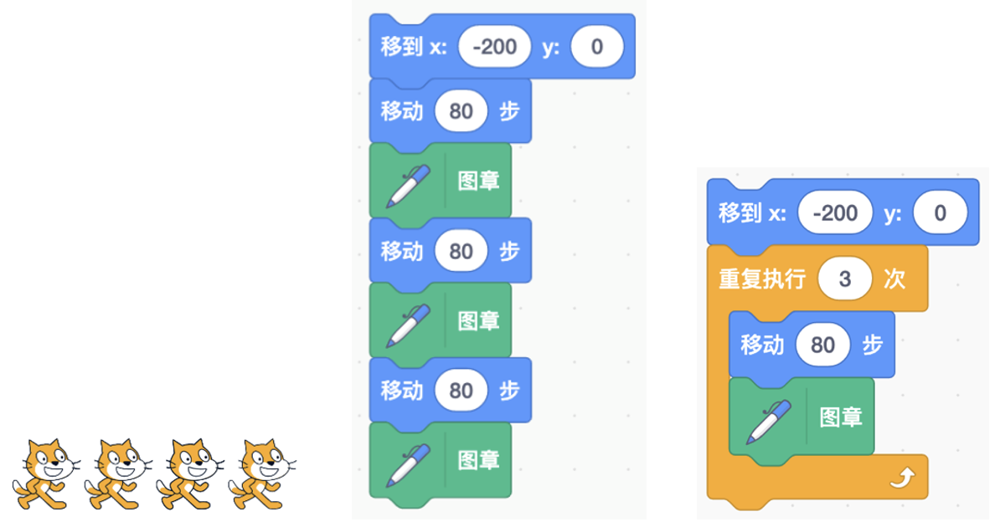
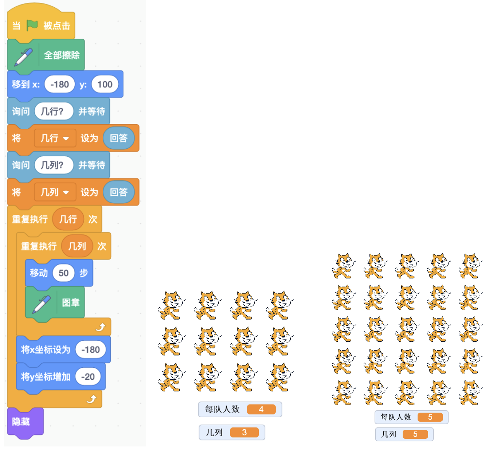

# 第4讲 循环:重复做动作

## 一、	知识点

**（1）什么是循环？**

现在我来介绍循环。循环就是把一个或者几个动作重复做很多次。比如我 们想让小猫排成一行，每隔 80 步留个影(见图 4-1)。
     

图4-1 小猫每隔 80 步留个影(左)、不用循环的脚本(中)、用到循环的脚本(右)

这个功能可以这样实现:留几个影就写几遍(见图 4-1 中间部分)。不过这 样写太麻烦了。这里小猫只移动了 4 次，留了 4 个影子，用了 8 个积木块;要 是走上 10 000 步，那得用多少积木块啊?这个程序编写起来可要等到猴年马月啊!

这时“重复执行”积木就能帮上忙了，我们用“重复执行 4 次”积木块， 能够达到同样的效果(见图 4-1 中右侧图)。
在程序里的“重复执行”指的就是循环。你看这样简单吧!

......

其他内容请参见书中第4讲。

## 二、动手练

**实验：** 阅兵方阵

**实验目的：** 

咱们今天要做一个实验。大家都看过阅兵吧?士兵们站成了一个矩形，非 常整齐。今天我们就用小猫来模拟一下，让它排个阅兵方阵吧。

听到这里你可能会不明白——阅兵方阵有很多个人，我这里只有 1 个角 色，怎么办?你们可能会想到用多个角色，但是我们等一下还要安排它们站到 不同的位置，还要根据这个方阵有多少人来添加角色、复制代码，是不是很 麻烦?

我先来告诉大家吧，这可以用克隆技术来实现，这个技术在下一讲就介绍。现 在我们只用一个小猫角色，让它去指定的位置盖个图章吧。

图 4-4 阅兵方阵程序(左)及实验结果示例(中、右)

**代码下载** 

[阅兵方阵的代码](Code/第4讲-阅兵方阵.sb3) 

## 三、教师点评

循环就是重复。重复一段脚本的笨方法就是重复几次写几遍，不过这样一 来，一是写程序很慢，二是有时候事先无法判断到底要重复几次。Scratch 里 的“重复”积木是更好的一种方法。

这一讲从对比这两种方法开始，孩子们掌握得很快，写得很有乐趣。当 然了，孩子们初学“重复”，也犯了一些典型的错误，比如边界条件设置不 对、循环变量更改方式不对，等等。孩子们把这些错误都记录了下来，以免 再犯。

我们还给孩子们补充了一些“布尔变量”的知识:布尔变量是只有“真、 假”两个值的变量，是英国数学家乔治·布尔提出的。

布尔是一位小学老师，他提出了用布尔变量表示“一句话是对还是错”， 然后把逻辑推理表示成“公式的运算”。这样的好处是:即使是复杂的逻辑推 理，我们只需要按部就班地一步一步运算，就能验证推理是否正确，并得到逻 辑推理的结论。

[返回上级](index.md)

