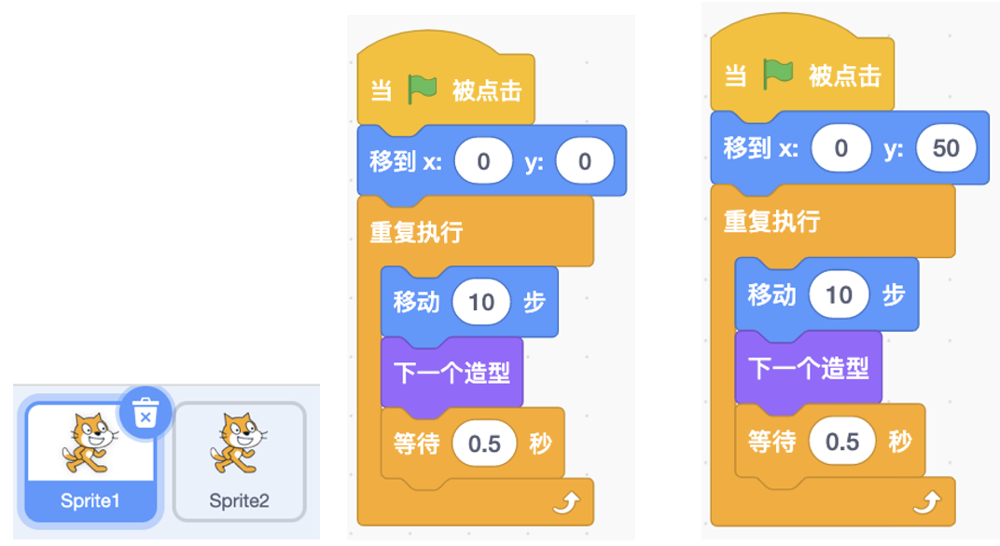
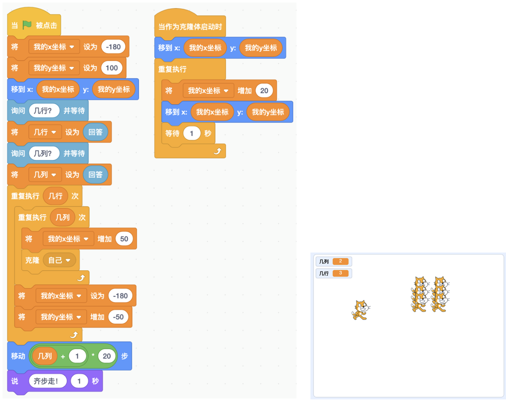

# 第5讲 克隆:角色的双胞胎和多胞胎

## 一、	知识点

**（1）	什么是克隆？** 

你听说过克隆羊吗?别给弄混了，它和试管山羊是不一样的。试管山羊是 从母羊的卵细胞里培养出来的小羊，而克隆羊是用一只羊的体细胞做出来的一 只完全一模一样的羊。

我上网查了一下，在生物学中，克隆是指生物体通过体细胞进行的无性繁 殖，有时也指应用这项技术繁殖出的基因型完全相同的后代个体。卜老师说克 隆是英文单词“ clone ”的音译，原意表示“无性繁殖”，引申义是“复制”。

好了，现在我们继续说程序。程序里的克隆就是复制一个一模一样的角 色，生成角色的双胞胎，甚至多胞胎。关键是这些多胞胎有相同的脚本，能够 避免我们为每个角色重复写脚本，是不是很方便?

**（2）	什么用克隆？**

我们用上一讲里的阅兵方阵做例子，你立刻就会明白什么时候会用到克隆 了。在上一讲里，每只小猫是用“图章”积木画出的一个图片，这个阅兵方阵 是不能动的。

要是想让阅兵方阵整体列队行进，那该怎么办呢?小猫要想移动，就得有脚本 啊，所以一种方法是有几只小猫，我们就创建几个角色，为每个角色写一个脚本。

咱们从最简单的、只有两只小猫的队列做起:我们建立两个角色，一个叫 Sprite1，另一个叫 Sprite2(见图 5-1 中左侧部分)。这两只小猫的脚本基本上 是相同的，只是起点有些差异:一个是从(0, 0)点起步走，一个是从(0, 50) 点起步走(见图 5-1)。

这两个角色负责移动的脚本是一模一样的。点击一下绿旗，你会看到它们 走起来步调一致，很整齐。

现在两只小猫可以列队行进了。不过要是 1000 只小猫列队行进，那可得 手动建立 1000 个角色，每个角色的脚本虽然一模一样，可是我们还得手写啊， 这可怎么办?

这时就该让克隆技术大显身手了:我们建 1000 个小猫的克隆体，这些克 隆体都有相同的脚本，这就避免了我们为每个角色单独写脚本。

图 5-1 两个角色(左)及它们的阅兵方阵脚本(中、右)

......

详细内容请参见书的第5讲。

## 二、动手练

**实验：** 阅兵方阵列队前进

**实验目的：** 

让小猫排成一个阅兵方阵，并且列队行进。

**代码下载** 

[阅兵方阵列队行进的代码](Code/第5讲-阅兵方阵列队行进.sb3) 

## 三、教师点评

克隆是非常有用的技术，能够避免重复写脚本。当两个角色的脚本完全相同 时，我们把这个角色设置为一个角色的两个克隆体，只需要写一份脚本就可以了。

这一讲从“阅兵方阵列队行进”讲起，从一开始的笨方法引出“克隆”技 术。对比笨方法和用了“克隆”技术的新方法，孩子们很快就明白了什么时候 用克隆技术。

[返回上级](index.md)

