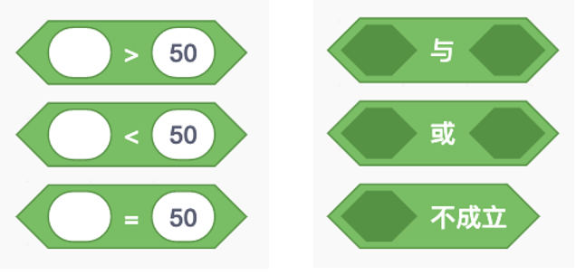
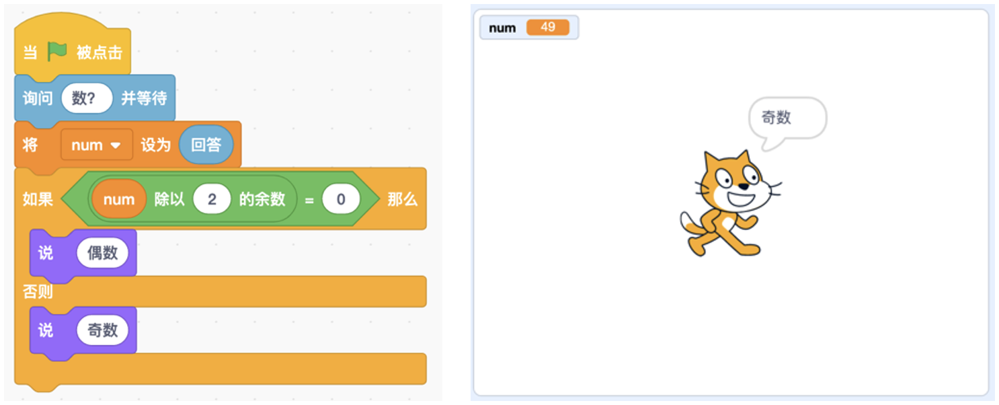

# 第6讲 条件判断:角色根据情况做动作

## 一、	知识点

### （1）	什么是条件判断？ 

角色的有些动作，不是总是执行的，而是根据情况有选择地执行。比如我 想去踢球，可是妈妈说踢球可以，不过得满足一个条件:

***如果“做完作业”，那么“可以去踢球”;否则“只能继续留在家里”。*** 

在这个例子中，“做完作业”就是条件。对于一个条件只有两种结果:要 么满足，要么不满足。

### （2）	多个条件的组合 

如果有两个条件的话，组合就多了。比如除了“做完作业”这个条件之外， 妈妈又提高了要求，提出了第二个条件:

***如果“做完作业”，并且“弹琴时间 >50 分钟”，那么“可以去踢球”;否 则“只能继续留在家里”。***

在这个例子中，“做完作业”是条件 1，“弹琴时间 >50 分钟”是条件 2， 同时满足这两个条件才能去踢球，这时候就用“条件 1 与条件 2”。

我总是琢磨，要是换成下面的组合该多好:如果“做完作业”，或者“弹 琴时间 >50 分钟”，那么“可以去踢球”;否则“只能继续留在家里”。这样 的话，两个条件中有一个成立就可以去踢球，我就可以挑简单的做了。

图 6-1 Scratch 中用“>,<,=”做条件判断(左)以及条件的组合(右)

......
详细内容请参见书的第6讲。

## 二、动手练

### 实验：判断奇偶数

#### 实验目的： 

用户输入一个数，小猫判断这个数是奇数还是偶数，并说出“是奇数”或 “是偶数”。

图6-2 判断奇偶数的程序（左）及实验结果示例（右）

#### 代码下载及Web版

点击[判断奇偶数的代码](Code/第6讲-奇偶数判断-改正bug2.sb3)下载于本地运行，或点击[判断奇偶数的Web版](https://scratch.mit.edu/projects/683245250/)直接运行 

国内用户如果无法访问scratch.mit.edu的话，请点击[国内可访问的Web版](https://mblock.makeblock.com/project/1433924)直接运行

--- 
## 三、教师点评

日常生活中常常会用到条件判断:我们根据条件做不同的事情。稍微难一点的 地方是条件的组合，因为有时需要同时满足两个条件，有时则需要两个条件满足 一个就可以。不过只要联系自己身边的例子，孩子们也能够很快掌握条件的组合。

[返回上级](index.md)

