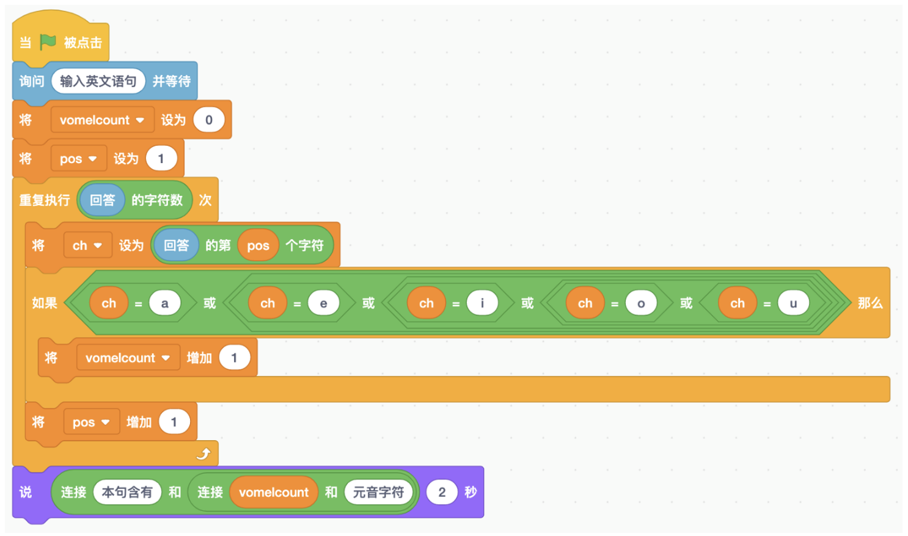

# 第9讲 字符串:把几个字母合起来

## 一、	知识点

在上一讲，我们学习了角色的一些基本动作；在这一讲里，我们再多介绍一些。

### （1）	什么是字符串变量?

字符我们很熟悉:a, b, c,..., z 这 26 个英文字母，每个字母都是一个字符; 0, 1, 2,..., 9 这 10 个数字，每个也都是一个字符。键盘上还有一些奇怪的符 号，比如 $, @, ^, %，还有空格，也是字符。

如果我们把几个字符合起来，穿成一串，就是字符串了。比如我的名字 “Wenshan Wei”，就是一个字符串。

### （2）	对字符串变量有哪些操作?

对字符串变量来说，可以有如下几种操作: 

(1)创建字符串变量:创建字符串变量和创建其他类型变量的方法没有区
别，都是点击左侧的“变量”按钮，再点击“建立一个变量”，就可以创建一 个字符串变量了。注意，Scratch 里不区分变量类型，比如整数 12345 和小数 3.1415926 也会被当作字符串来处理。

(2)给一个字符串变量赋值:字符串变量的赋值方法也是和其他变量没有 区别的，只需点击左侧的“变量”按钮，再使用“将...设为...”积木即可。比 如我们用“将 myName 设为 Wenshan Wei”积木，就能把 myName 设置成字 符串“ Wenshan Wei”。老师提醒我们，积木里的第二个参数可以不填，这样就能把变量 myName 设置成空字符串，这是很有用的操作。

(3)连接两个字符串:点击左侧的“运算”按钮，我们会看到“连接...... 和......”积木，这块积木能够把两个字符串连接起来。比如“连接 I am 和
myName”就得到了一个新的字符串“IamWenshanWei”。 

(4)取字符:应用“...的第...个字符”积木，我们能够从字符串中取出 某个位置上的字符。比如应用“3.1415926 的第 1 个字符”积木就得到了字符 “3”，应用“3.1415926 的第 2 个字符”积木就得到了字符“ .”。要是我们输入 的第二个参数超过了字符串的长度，比如应用“3.1415926 的第 10 个字符”积
木，那么什么也不会得到(这叫作“空字符”，就是“一无所有”的意思)。 

(5)计算字符串长度:应用“...的字符数”积木，能够得到字符串的长度。
比如应用“3.1415926 的字符数”积木，会得到 9。 

(6)查询是否包含另一个小的字符串:应用“...包含...”积木可以判断一
个字符串是否包含一个小一点的字符串。比如“3.1415926 包含 3.14”积木返 回值为“真”，而“3.1415926 包含 999”积木返回值为“假”。

图 9-1 中显示了第 3~6 种操作的积木。

图 9-1 字符串的基本操作

## 二、动手练

### 实验： 元音字母计数

#### 实验目的： 

用户输入一个英文单词或者一句话，程序统计出 现了多少个元音字母。

#### 基本思路： 

元音字母共有 5 个，即 a, e, i, o, u。我们先计算出输入字符串的长度，然 后从第一个字符开始，逐个判断是否是元音字母;如果是，则把元音字母计数 器增加 1。

图 9-2 统计元音字母数的程序

我输入了我们 SIGMA 数学和算法兴趣班上小朋友的名字的汉语拼音，程 序运行结果正确，名字中有空格也没关系(见表 9-1)。

我发现包若宁的名字中有 5 个元音字母，是最多的;张秦汉的名字里只有 3 个元音字母，是最少的。这是因为我们的名字都是 3 个字的，基本上一个字 里的韵母里有 1~2 个元音字母。

表9-1 SIGMA兴趣组同学姓名中的元音字母数

#### 代码下载 

[元音字母记数的代码](Code/第9讲-元音字母数目.sb3) 

## 三、教师点评

字符串是一个基本数据类型，就是把几个字符串成一串。日常生活中，我 们的姓名就是一个字符串。通过数姓名中元音字母个数这个小实验，孩子们掌 握了字符串的基本操作。

值得说明的是，Scratch 里没有数据类型的概念，即不区分字符串、整数 和小数，因此，我们要避免出现“对字符串变量进行加减乘除”的情况。

[返回上级](index.md)

