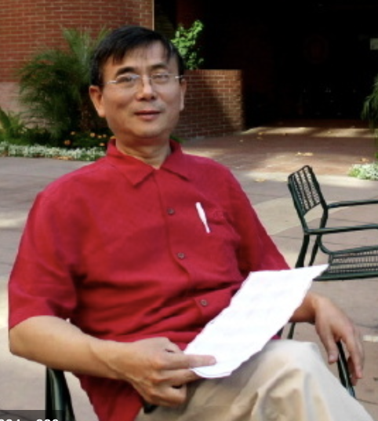

# 序 

***徐志伟 研究员 中科院计算所***

人生一件幸福事，是在中关村看见10来岁的孩子们睁大着闪闪发光的眼睛，兴奋地向你讲述计算思维的美妙。你手中的这本《六个小孩学编程》，传递着这种兴奋和幸福。

这本书是6名小学生写的编程课程学习笔记，经过3位家长兼教师的批注点评。这本书凝聚了他们过去一年半的心血、激情和智慧，具有三个鲜明的特点，特别适合全国各地的中小学生和他们的家长使用，也适合中小学用作计算机课程的教材。

特点一：独特的亲子游戏。作为家长，中科院计算所的3位研究员设计了一种有温度的亲子游戏，实践了一种以孩子为中心的学习过程。学习编程和计算思维不再是枯燥的讲课做作业，而是孩子们与家长一起玩电脑游戏和心智游戏的交心互动。他们的课堂洋溢着爱心和欢乐。爱孩子是家长的天性；本书为家长提供了一个与孩子欢乐交心的独特渠道。

特点二：动手动脑，内容走心。作为教师，3位研究员精心设计了这门编程和计算思维课程，既循序渐进，又充满了动手动脑的内容，实践了图灵奖得主高德纳（Donald Knuth）最近提出的终极测试：“对我是否理解某项知识的终极测试是：看我能否对计算机讲清楚”。本书作者之一的包若宁小朋友没听说过斯坦福大学的高德纳教授，但她在课程学习实践中，自己形成了与高德纳老师类似的观点：“……有一点错计算机就会不客气。可是如果程序写对了，计算机又会给你意外的惊喜。”

特点三：实例丰富，易于使用。这本书及其网站提供了丰富的知识点，每个都配有实例。学习工具就是人手一台电脑，也可以通过互联网远程上课学习；用到的一些辅助教具，如三角形纸板等，都是很容易地自行制作的。假如每周花4小时的话，学完全书内容大概需要大半年时间。家长和教师可以根据实际情况适当裁剪第十讲之后的内容。

今后20年有两个大趋势：中国将进入信息社会，并跻身创新型国家前列；因此，培养中小学生成为信息社会的创新人才，是社会的刚需。《少儿计算思维养成记》提供了一部有趣而又高质量的教材。希望你喜欢它！

恭喜孩子们！也向他们的父母致敬！

中国科学院计算技术研究所 徐志伟

2021年9月1日，中关村 

[返回上级](index.md)

