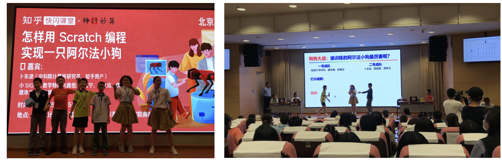
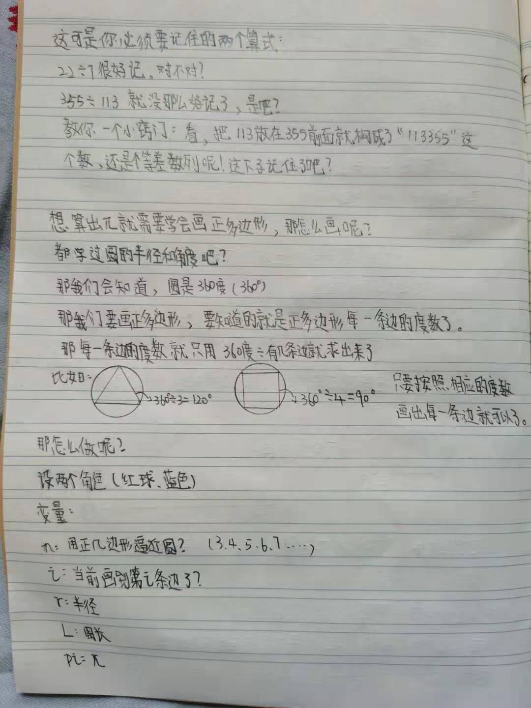
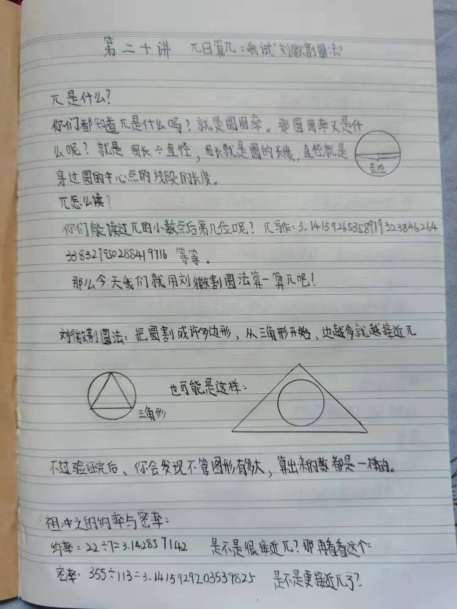
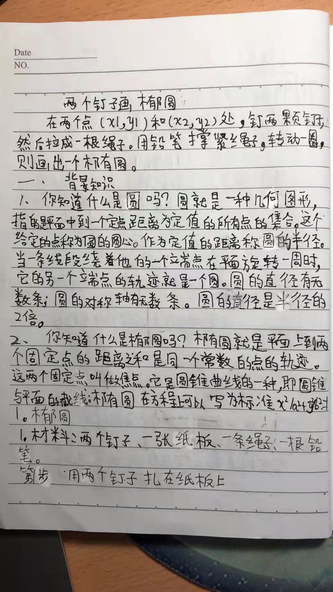

## 视频与手稿

### 视频
2021年5月22日，小SIGMA数学特别兴趣组7位小朋友参加了中科院计算所的“公众科学日”，上台表演了“如何用Scratch编程实现一只阿尔法小狗？”。

孩子们在300位现场观众的目光注视下，在台上编程实现阿尔法小狗；这次活动还由知乎课堂线上转播，有35万人收看。

好在我们事先准备充分，现场编程出了bug，也顺利debug了。最后还分成两个战队，每队用不同的棋局打分，比比谁的狗厉害！能够完成现场编程和讲解，表明孩子们基本上掌握了博弈的入门知识。

[如何用Scratch实现一只阿尔法小狗？(2021年度计算所“公众科学日”知乎课堂)](http://bioinfo.ict.ac.cn/~dbu/Video/SIGMA-MiniAlphaGo.mp4)

### 原始手稿

孩子们每上完一节课，都会推举一位同学负责本讲的总结，包括记笔记、写心得、写体会。下面是当时孩子们写的原始手稿，后来才
录入电脑。

孩子们还发现了一个录入利器：科大讯飞语音输入法；这大大加快了进度。

