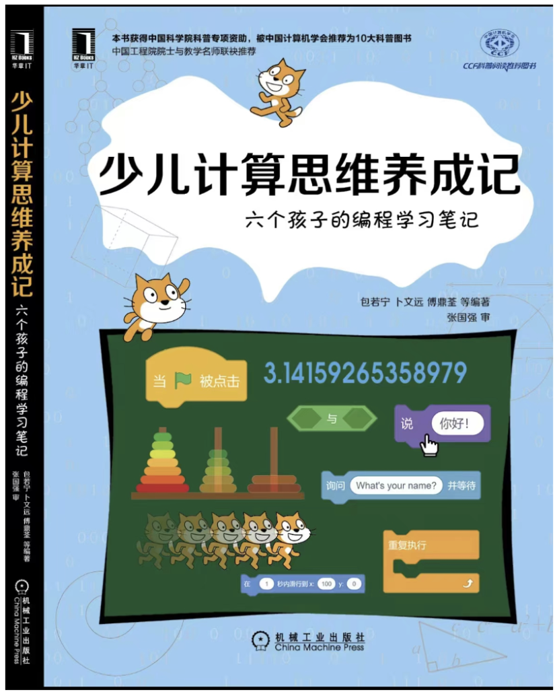
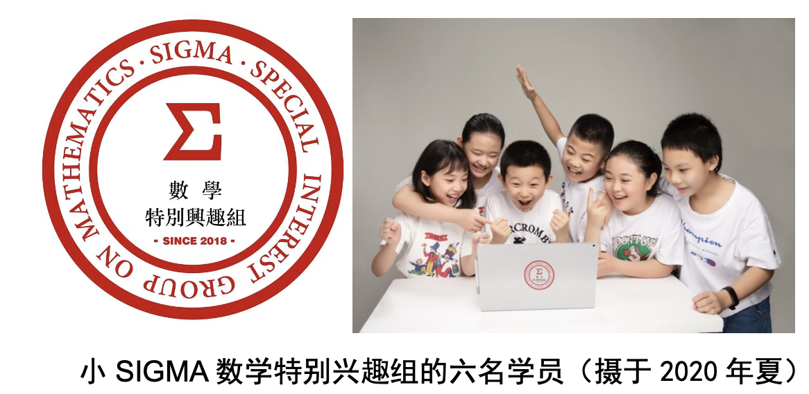
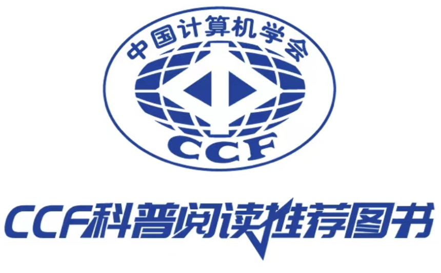
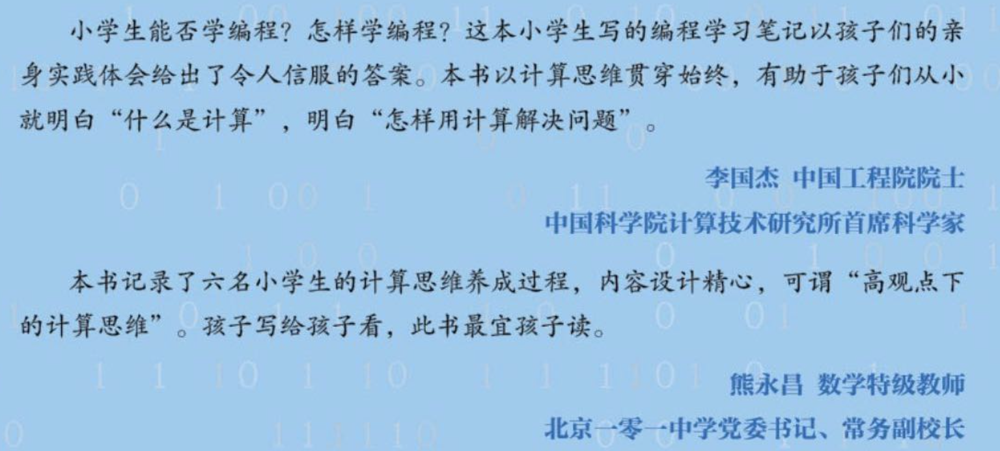

# 少儿计算思维养成记---六个小孩的编程学习笔记

## 作者：

小SIGMA数学特别兴趣组成员：左起：包若宁（中关村一小四年级）、魏文珊（中关村一小四年级）、傅鼎荃（北大附小四年级）、张秦汉（北京双榆树中心小学三年级）、卜文远（中关村一小四年级）、谭沛之（中关村一小五年级）

## 指导教师：

左：卜东波，中科院计算所研究员；研究方向：计算机算法设计、生物信息学；提出了逆向蒙特卡罗采样算法、蛋白质结构预测算法FALCON；在国科大讲授《算法设计与分析》，讲授如何观察问题、如何根据观察设计算法求解问题

中：包云岗，中科院计算所研究员；研究方向：计算机系统；负责国科大“一生一芯”实践计划；在国科大讲授《操作系统》，讲授如何设计CPU和计算机系统

右：兰艳艳，清华大学教授、前中科计算所研究员；研究方向：统计学、机器学习，排序学习的代表性人物；在国科大讲授《人工智能与机器学习》，教计算机如何学习

[序](Preface.md)

[前言](PrefaceSIGMA.md)

[教师的话（一）](TeachersWords.md)

[教师的话（二）](TeachersWords2.md)

## 编程基础篇
---

第一讲 [什么是计算机程序？](Lec1.md)

第二讲 [角色的动作、绘图和音乐演奏](Lec2.md)

第三讲 [变量：角色的记忆](Lec3.md)

第四讲 [循环：重复做动作](Lec4.md)

第五讲 [克隆：角色的双胞胎和多胞胎](Lec5.md)

第六讲 [条件判断：角色根据情况做动作](Lec6.md)	

第七讲 [过程：程序的模块化](Lec7.md)	

第八讲 [列表：把几个变量合起来](Lec8.md)	

第九讲 [字符串：把几个字母合起来](Lec9.md)	

第十讲 [收发消息：角色之间的沟通和协调](Lec10.md)	

## 计算思维篇
---

第十一讲 [逐级逼近法：刘徽割圆法估计Π](Lec11.md)

第十二讲 [聪明的枚举：巧解数字谜](Lec12.md)	

第十三讲 [再论聪明的枚举：三阶幻方](Lec13.md)

第十四讲 [从最简单的做起：4个和尚分馍馍](Lec14.md)

第十五讲 [用“试错法”求解鸡兔同笼问题](Lec15.md)

第十六讲 [随机有威力：打圆形靶子估计Π](Lec16.md)

第十七讲 [再论随机有威力：布丰投针估计Π](Lec17.md)

第十八讲 [玩游戏体会“递归法”：河内塔游戏](Lec18.md)

第十九讲 [“递归法”的应用：斐波那契数列与黄金分割](Lec19.md)

第二十讲 [玩游戏体会“搜索法”：走迷宫](Lec20.md)

第二十一讲 [玩游戏体会“二分法”：找钻石](Lec21.md)

第二十二讲 [“二分法”的应用：估计2的平方根](Lec22.md)

第二十三讲 [仿真世界：牛顿的大炮](Lec23.md)

第二十四讲 [再论仿真世界：森林里有几只老鼠、几只猫头鹰？](Lec24.md)

第二十五讲 [博弈初探：会下TIC-TAC-TOE棋的阿尔法小狗](Lec25.md)

## 后记

[写在后面](Afterword.md)

## 讲解视频与手稿

[小SIGMA讲解本书章节的视频与原始手稿](Video-and-drafts.md)

## 供教师、家长朋友使用的教学PPT

[教学PPT](Slides.md)

## 勘误

如您发现书中的错误，请发email至：[Dongbo Bu]<dbu@ict.ac.cn> ，谢谢

## 书评

本书被推荐为中国计算机学会10大科普阅读推荐书目，获得中国科学院科普专项支持

## 致谢

本书得到[机械工业出版社、南京师范大学张国强教授、中科院计算所科普协会、研究生处、亲子协会等大力协助](Acknowledgement.md)。没有这些帮助，本书的问世是难以想象的

## 购买渠道

本书已在[京东](https://item.jd.com/13702980.html
)、[当当](http://product.dangdang.com/29386865.html
)上架。

